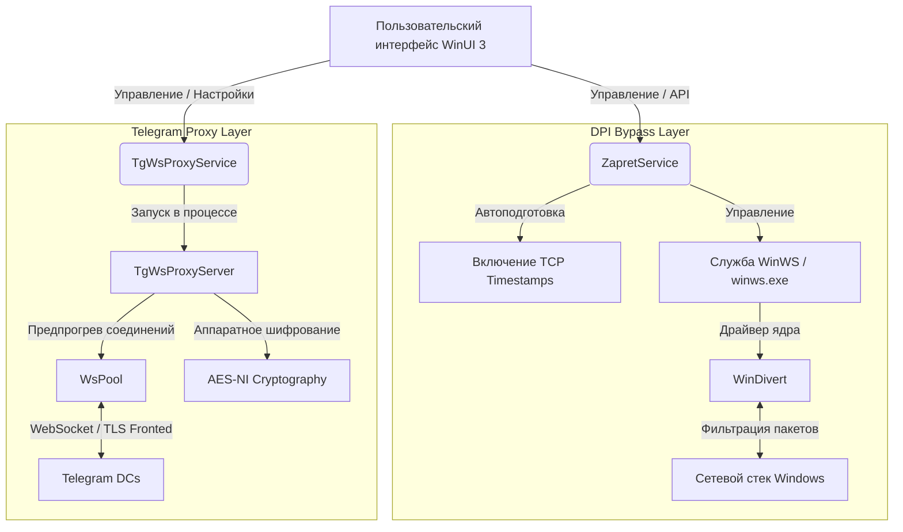

  

<h1 align="center">Zapret Mirrly GUI</h1>

  <b>Современное графическое решение (WinUI 3) для автоматического обхода DPI-блокировок YouTube, Discord и системного проксирования Telegram в один клик.</b>

  
  
  
  
  

  

> [!IMPORTANT]
> **Требуются права Администратора.** Для корректного монтирования драйвера ядра `WinDivert` и управления службами Windows приложению необходим повышенный уровень привилегий. При запуске программа автоматически запросит стандартное UAC-подтверждение.

---

## Содержание
1. [О проекте](#о-проекте)
2. [Ключевые преимущества](#ключевые-преимущества)
3. [Философия проекта: Доступность и Прозрачность](#философия-проекта-доступность-и-прозрачность)
4. [Основные возможности](#основные-возможности)
5. [Архитектура и технические детали](#архитектура-и-технические-детали)
6. [Системные требования](#системные-требования)
7. [Быстрый запуск](#быстрый-запуск)
8. [Сравнение с альтернативами](#сравнение-с-альтернативами)
9. [Часто задаваемые вопросы (FAQ)](#часто-задаваемые-вопросы-faq)
10. [Зависимости и благодарности](#зависимости-и-благодарности)
11. [Лицензия](#лицензия)

---

## О проекте

**Zapret Mirrly GUI** — это развитая графическая оболочка, объединяющая возможности низкоуровневого DPI-обходчика `zapret` и специально спроектированного высокоскоростного Telegram-прокси. 

Проект решает главную проблему консольных утилит — сложность настройки и отсутствие обратной связи. Вместо редактирования конфигурационных файлов вручную и запуска разрозненных `.bat` скриптов, пользователь получает единую среду управления с интерактивной диагностикой, визуальным редактором правил и встроенным системным треем. Приложение работает полностью локально, сохраняя вашу конфиденциальность: весь трафик обрабатывается непосредственно на вашем ПК без отправки на внешние VPN-серверы.

---

## Ключевые преимущества

**Zapret Mirrly GUI** сочетает передовой дизайн WinUI 3 с глубокой интеграцией в системные API Windows для максимальной производительности и комфорта.

### 1. Трёхкомпонентная система тем и нативное размытие (DWM)
Приложение поддерживает гибкую кастомизацию внешнего вида:
* **Чёрный графит:** Глубокий тёмный стиль с выверенной контрастностью и прозрачными плашками элементов управления.
* **Светлая тема:** Контрастный, яркий дизайн с подложкой в стиле матового стекла (Apple Light Glass).
* **Тёмная тема:** Классический графитовый стиль для работы в условиях низкой освещенности.
* **Composition API & DWM:** Прямое управление параметрами `DWMWA_USE_IMMERSIVE_DARK_MODE` гарантирует нативную отрисовку оптических эффектов Acrylic и Mica без задержек и мерцания.

### 2. Автоматизация и умная самодиагностика
* **Динамическое обучение (Auto Hostlist):** Автоматический анализ сетевых сбоев во время серфинга с добавлением заблокированных ресурсов в список обхода без участия пользователя.
* **Встроенный диагностический модуль:** Пошаговое тестирование сетевой подсистемы с проверкой целостности драйвера WinDivert, работы BFE и доступности целевых сайтов.
* **Гибкая фильтрация протоколов:** Выборочное включение обработки IPv4 и IPv6 для устранения сетевых задержек у провайдеров с некорректной поддержкой IPv6.

### 3. Интерактивный системный трей и фоновая работа
* Виджет быстрого управления по левому клику и полноценное контекстное меню по правому клику.
* Полная синхронизация визуального стиля, шрифтов и прозрачности подложки с выбранной темой приложения.
* Запуск обхода, выбор пресетов и управление Telegram-прокси в один клик без разворачивания основного окна.

---

## Философия проекта: Доступность и Прозрачность

При проектировании **Zapret Mirrly GUI** мы руководствовались двумя ключевыми принципами: **максимальная простота для конечного пользователя** и **абсолютная наблюдаемость процессов «под капотом»**.

### 1. Доступность для каждого (Zero-Threshold UX)
Интерфейс приложения спроектирован так, чтобы им мог успешно пользоваться человек с любым уровнем компьютерной грамотности:
* **Запуск в один клик:** Основной сценарий обхода не требует ввода консольных параметров или знания сетевых протоколов. Достаточно открыть программу и нажать кнопку «Запустить» или «Установить службу».
* **Умные настройки по умолчанию:** Все необходимые для работы драйверы, системные пути и стартовые конфигурации уже оптимизированы и настроены.
* **Лаконичность:** В приложении нет перегруженных меню или избыточных интерфейсных блоков. Каждый элемент управления выполняет строго отведенную ему задачу.

### 2. Бескомпромиссная информативность и отладка
Простота интерфейса сочетается со сквозным мониторингом:
* **Журналирование каждого шага:** Любое действие программы записывается в структурированный журнал.
* **Информативность вместо сухих ошибок:** Подробные текстовые отчеты о возникших проблемах помогают быстро понять причину сетевого сбоя.
* **Инструменты для анализа:** Встроенная вкладка диагностики и цветной живой лог консольного вывода позволяют локализовать проблему и подобрать рабочую стратегию обхода.

---

## Основные возможности

* **Элегантный Fluent интерфейс:** Дизайн на базе WinUI 3 с поддержкой эффектов Mica и Acrylic, плавной анимацией и высочайшей плотностью компоновки.
* **Управление Windows-службой:** Установка и удаление системной службы `winws` в один клик для автоматического обхода сразу после загрузки ОС.
* **Автоматический запуск и работа в трее:** Сворачивание в область уведомлений с удобным контекстным меню.
* **Интегрированный C# Telegram-прокси (TgWsProxy):** Высокопроизводительный локальный прокси-сервер на чистом C# (.NET 10) с пулом пре-прогретых соединений (`WsPool`) и аппаратным шифрованием AES-NI.
* **Интерактивная диагностика:** Автоматический инструмент проверки доступности ресурсов и выявления причин блокировок.
* **Информативный журнал логов:** Вывод работы `winws.exe` в реальном времени с интеллектуальным цветовым кодированием.
* **Встроенный редактор списков:** Управление черными и белыми списками доменов прямо внутри приложения.
* **Полная автономность (Self-Contained):** Один портативный файл `ZapretMirrlyGUI.exe` содержит в себе все необходимые зависимости, включая .NET 10 Runtime и драйвер `WinDivert`.

---

## Архитектура и технические детали

### 1. Движок обхода DPI
В качестве низкоуровневой основы используется утилита `winws.exe` (проект `zapret` разработчика bol-van):
* **Принцип перехвата:** Драйвер ядра `WinDivert` перехватывает сетевые пакеты на уровне сетевого интерфейса Windows.
* **Методы обхода:** Модификация TLS/TCP пакетов: фрагментация TLS ClientHello, изменение регистра полей HTTP-заголовков, манипуляции с размером окна TCP (TCP Window Size) и внедрение фейковых TLS SNI запросов (Fake TLS).
* **TCP Timestamps:** Приложение автоматически активирует временные метки TCP (`Tcp1323Opts`), устраняя проблемы несовместимости при сборке фрагментированных пакетов.

### 2. Локальный WebSocket-прокси для Telegram
Интегрированный C# прокси-сервер обеспечивает обход блокировок мессенджера:
* **Pre-warmed WebSocket Pool (`WsPool`):** Заранее создает и поддерживает пул открытых WebSocket-соединений к дата-центрам Telegram. Обмен данными начинается мгновенно без задержек на рукопожатия.
* **Аппаратное ускорение шифрования:** Потоковое шифрование пакетов использует векторные инструкции процессора AES-NI (`Aes.EncryptEcb`), минимизируя загрузку CPU.
* **SNI Fronting:** Трафик маскируется под доверенные веб-ресурсы и направляется через Cloudflare Workers, обходя блокировки протокола MTProto.

---

## Системные требования

* **Операционная система:** Windows 10 (версия 1809 и новее) или Windows 11 (x64).
* **Права:** Администратор (необходимы для инсталляции службы автозапуска и драйвера `WinDivert`).
* **Совместимость:** Перед активацией обхода убедитесь, что другие утилиты на базе `WinDivert` (GoodbyeDPI, сторонние сборки zapret) остановлены.

---

## Быстрый запуск

1. Скачайте последнюю версию `ZapretMirrlyGUI.exe` из раздела **[Releases](https://github.com/joycecurcirt539-dot/zapret-mirrly-gui/releases)**.
2. Запустите файл от имени Администратора.
3. На **Панели управления** выберите желаемый пресет.
4. Нажмите **«Запустить»** для разовой сессии или **«Установить службу»** для регистрации автозапуска в Windows.
5. Для Telegram: перейдите во вкладку **Telegram прокси**, запустите сервер и нажмите кнопку быстрого подключения.

---

## Сравнение с альтернативами

| Функция / Возможность | Zapret Mirrly GUI | GoodbyeDPI | GoodbyeDPI GUI | Ручные `.bat` скрипты |
|:---|:---:|:---:|:---:|:---:|
| **Интерфейс WinUI 3 (Fluent/Mica)** | Да | Нет | Устаревший WinForms | Нет |
| **Системная служба (автозапуск)** | Да (1 клик) | Настройка вручную | Нет | Требует sc.exe |
| **Встроенный обход Telegram (C#)** | Да (AES-NI / WsPool) | Нет | Нет | Нет |
| **Интерактивная диагностика** | Да | Нет | Нет | Нет |
| **Цветовой журнал логов** | Да | Нет | Нет | Нет |
| **Редактор списков в приложении** | Да | Нет | Ограниченный | Нет |
| **Портативный формат (Single EXE)** | Да | Да | Да | Нет |

---

## Часто задаваемые вопросы (FAQ)

<strong>YouTube или Discord всё равно тормозит/не работает. Что делать?</strong>

1. Убедитесь, что приложение успешно запустилось с правами Администратора и в логах нет ошибок монтирования драйвера `WinDivert`.
2. Перейдите на вкладку **Диагностика** и запустите тест. Он покажет, на каком этапе происходит блокировка (DNS, пинг или HTTP-запрос).
3. Попробуйте выбрать другой пресет на панели управления. Провайдеры связи используют разные конфигурации DPI, поэтому универсального пресета не существует (кому-то подходит `FAKE TLS`, кому-то `SIMPLE FAKE` или `ALT`).
4. Убедитесь, что другие DPI-обходчики (GoodbyeDPI и др.) полностью остановлены и их процессы не висят в диспетчере задач.

<strong>Зачем приложению права администратора?</strong>

Низкоуровневая утилита `winws.exe` использует драйвер `WinDivert` для фильтрации и модификации пакетов на уровне сетевых интерфейсов Windows, а также регистрирует службу автозапуска в системе. Подобные операции разрешены только процессам с правами Администратора.

<strong>Это безопасно? Куда уходит мой интернет-трафик?</strong>

Программа работает **полностью локально**. В отличие от VPN, здесь нет внешних серверов, через которые перенаправляется ваш трафик. Утилита лишь перехватывает заголовки пакетов на вашем ПК, модифицирует их для обхода фильтров провайдера и сразу отправляет дальше. Код проекта открыт.

<strong>В чём разница между этим обходом и классическим VPN?</strong>

VPN шифрует весь ваш трафик и передает его через удаленный сервер, что часто приводит к снижению скорости и увеличению пинга. Zapret Mirrly GUI изменяет структуру отправляемых вами пакетов локально, поэтому скорость интернета остается максимальной.

<strong>Почему исполняемый файл весит около 300 МБ?</strong>

Приложение скомпилировано в режиме `Self-Contained`. Внутрь упакована полная среда выполнения .NET 10 Runtime, бинарные файлы `winws.exe` для разных архитектур, драйвер `WinDivert` и все конфигурации. Приложение полностью портативно и не требует дополнительных библиотек.

---

## Зависимости и благодарности

Проект существует благодаря открытым разработкам сообщества:
* **[bol-van](https://github.com/bol-van)** — автор низкоуровневого движка обхода [zapret](https://github.com/bol-van/zapret) и утилиты `winws`.
* **[Flowseal](https://github.com/Flowseal)** — создатель популярных конфигураций обхода [zapret-discord-youtube](https://github.com/Flowseal/zapret-discord-youtube) и концепта прокси-сервера [tg-ws-proxy](https://github.com/Flowseal/tg-ws-proxy).
* **[basil00 (WinDivert)](https://github.com/basil00/Divert)** — разработчик драйвера и библиотеки **WinDivert** (Windows Packet Divert) для перехвата пакетов в пользовательском режиме.

---

## Лицензия

Этот проект распространяется под свободной лицензией **MIT**. Подробности в файле [LICENSE](LICENSE).
