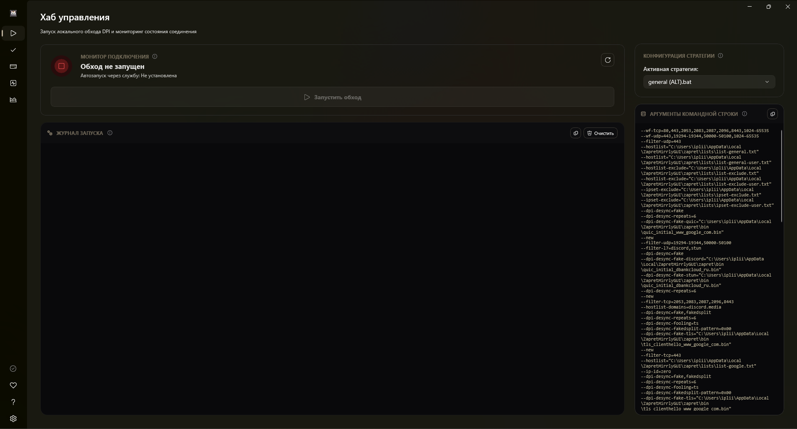
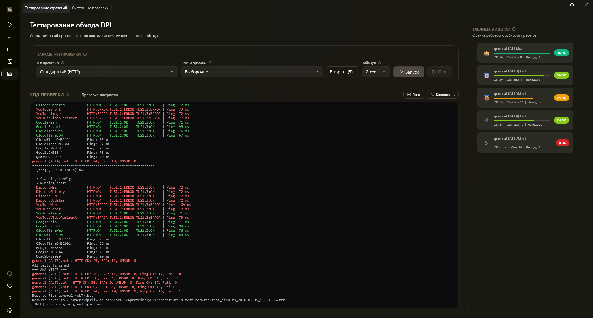
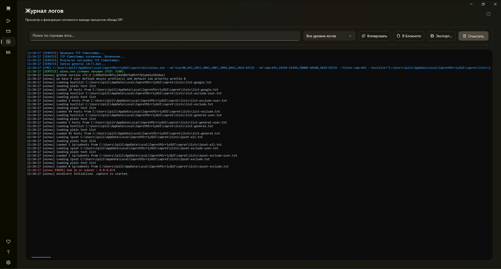
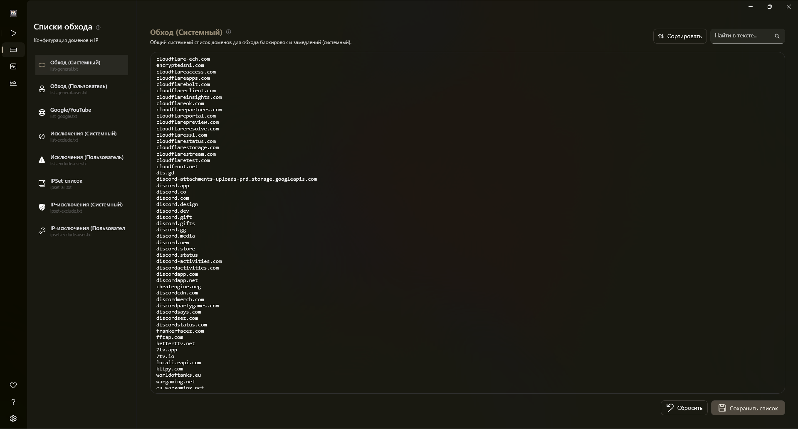
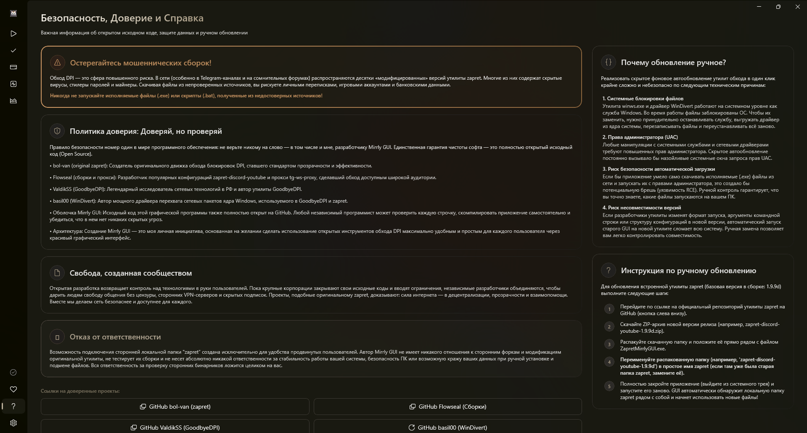
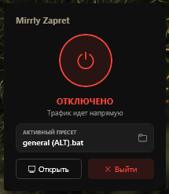

  

<h1 align="center">Zapret Mirrly GUI</h1>

  <b>Современный графический интерфейс (WinUI 3) для автоматического обхода DPI блокировок YouTube & Discord в один клик.</b>

  
  
  
  
  

  

> [!NOTE]
> 🔔 Репозиторий **Flowseal/zapret-discord-youtube** на GitHub снова активен и разморожен! **Zapret Mirrly GUI** построен на его сборке и предоставляет удобный графический интерфейс для обхода блокировок.

> [!WARNING]
> Для корректной работы (запуск winws, установка службы, использование WinDivert) **требуются права администратора**. Приложение автоматически запросит повышение прав UAC.

---

## 📖 Содержание
1. [Скриншоты и Возможности](#-скриншоты-и-возможности)
2. [Основные возможности](#-основные-возможности)
3. [Сравнение с аналогами](#-сравнение-с-аналогами)
4. [Системные требования](#-системные-требования)
5. [Установка и запуск](#-установка-и-запуск)
6. [Как это работает](#-как-это-работает)
7. [Частые вопросы (FAQ)](#-частые-вопросы-faq)
8. [Создатели и Благодарности](#-создатели-и-благодарности)
9. [Лицензия](#-лицензия)

---

## 📸 Скриншоты и Возможности

### 🏠 Главный хаб управления

  

  <i>Запуск и остановка утилиты обхода блокировок в один клик. Выбирайте предустановленные стратегии (FAKE TLS, SIMPLE FAKE, ALT) или устанавливайте службу для автоматического запуска при загрузке Windows.</i>

---

### 🔍 Интерактивная диагностика

  

  <i>Встроенный тест доступности популярных ресурсов (YouTube, Discord). Проверяет разрешение DNS, доступность по Ping и отправку тестовых HTTP-запросов, помогая определить, работает ли обход DPI.</i>

---

### 📊 Цветовой журнал логов

  

  <i>Динамический лог работы <code>winws.exe</code>. Все события разделены по категориям и подсвечиваются цветом (критические ошибки — красным, предупреждения — оранжевым, успешные статусы — зеленым), упрощая отладку.</i>

---

### 📝 Редактор списков доменов

  

  <i>Управляйте списками доменов (blacklist/whitelist) прямо из GUI без необходимости открывать блокнот и искать файлы конфигурации в проводнике.</i>

---

### ❓ FAQ и Безопасность (Справка)

  

  <i>Раздел ответов на часто задаваемые вопросы (FAQ), информация о безопасности работы приложения, локальном трафике и разъяснение необходимости прав администратора.</i>

---

### 📥 Управление в трее

  

  <i>Приложение сворачивается в системный трей, не занимая места на панели задач, и позволяет управлять состоянием службы через удобное контекстное меню.</i>

---

## ✨ Основные возможности

* 🖥️ **Премиальный современный UI:** Интерфейс в стиле Fluent Design с тёмной/светлой темой, эффектом Mica/Acrylic и плавными анимациями.
* ⚙️ **Управление Windows-службой:** Установка, удаление, запуск и остановка службы `winws` в один клик. Работает в фоне после закрытия окна.
* ⚡ **Менеджер пресетов:** Стратегии обхода DPI (FAKE TLS, SIMPLE FAKE, ALT) для YouTube и Discord. Поддержка собственных аргументов. Обход Telegram не гарантируется.
* 🔍 **Встроенная диагностика сети:** Тестирование Discord, YouTube, DNS и Ping прямо из приложения.
* 📝 **Живой лог `winws.exe`:** Вывод в реальном времени с цветовым кодированием событий для диагностики проблем.
* 📋 **Редактор списков доменов:** Удобное управление blacklist/whitelist файлами конфигурации `zapret`.
* 📦 **Один файл, без установки:** `ZapretMirrlyGUI.exe` — полностью автономный, .NET Runtime не нужен.

---

## ⚖️ Сравнение с аналогами

| Функция | **Zapret Mirrly GUI** | Ручные `.bat` скрипты | GoodbyeDPI GUI |
|---|:---:|:---:|:---:|
| Графический интерфейс | ✅ WinUI 3 | ❌ | ✅ (устаревший) |
| Windows-служба (автозапуск) | ✅ | ⚠️ Вручную | ❌ |
| Выбор пресетов | ✅ | ⚠️ Редактирование файлов | ⚠️ Ограниченно |
| Встроенная диагностика | ✅ | ❌ | ❌ |
| Живой лог с подсветкой | ✅ | ❌ | ❌ |
| Один EXE без установки | ✅ | ⚠️ Архив с файлами | ✅ |
| Открытый исходный код | ✅ MIT | ✅ | ✅ |
| Требует VPN/сервер | ❌ | ❌ | ❌ |

---

## 🖥️ Системные требования

* **ОС:** Windows 10 (сборка 1809+) или Windows 11 (x64)
* **Права:** Администратор (для WinDivert)
* **Сеть:** Активное подключение. Если используешь GoodbyeDPI — останови его перед запуском.

---

## 🚀 Установка и запуск

1. Перейди в раздел **[Releases](https://github.com/joycecurcirt539-dot/zapret-mirrly-gui/releases)**
2. Скачай `ZapretMirrlyGUI.exe`
3. Запусти **от имени Администратора**
4. Выбери пресет (например `general (FAKE TLS AUTO).bat`)
5. Нажми **«Запустить»** или **«Установить службу»** для автозапуска при старте Windows
6. Пользуйся свободным интернетом! 🎉

---

## 🛠️ Как это работает

При первом запуске приложение распаковывает ресурсы (`winws.exe`, драйвер `WinDivert`, конфигурационные скрипты) в `%LOCALAPPDATA%\ZapretMirrlyGUI`.

При запуске пресета `winws` перехватывает сетевые пакеты через `WinDivert` и модифицирует заголовки (разбивает TCP-сегменты, меняет регистр host-заголовков, отправляет фейковые TLS-запросы), обходя алгоритмы DPI провайдеров.

---

## ❓ Частые вопросы (FAQ)

<strong>YouTube / Discord всё равно не работает. Что делать?</strong>

1. Убедись что приложение запущено **от имени Администратора**
2. Попробуй другой пресет — разные провайдеры требуют разные стратегии
3. Открой вкладку **Диагностика** — она покажет где именно блокировка
4. Проверь вкладку **Логи** — нет ли ошибок в выводе `winws`
5. Убедись что GoodbyeDPI или другие DPI-инструменты **остановлены**

<strong>Зачем нужны права администратора?</strong>

Утилита `winws` использует драйвер `WinDivert` для перехвата сетевых пакетов на уровне ядра Windows. Это требует повышенных привилегий — без них драйвер просто не запустится.

<strong>Это безопасно? Куда уходят мои данные?</strong>

Данные никуда не уходят. Приложение работает **полностью локально** — нет серверов, нет телеметрии, нет VPN-туннелей. `winws` только модифицирует заголовки пакетов на твоём ПК. Исходный код открыт — можешь проверить сам.

<strong>Чем это отличается от VPN?</strong>

VPN перенаправляет **весь** трафик через чужой сервер, замедляя соединение. `winws` работает локально и только изменяет способ отправки пакетов — скорость не страдает, сервер не нужен, анонимность не обеспечивается (это не VPN).

<strong>Работает ли Telegram?</strong>

Zapret Mirrly GUI оптимизирован для YouTube и Discord. Обход Telegram **не гарантируется**. Для Telegram используй [tg-ws-proxy на GitHub](https://github.com/Flowseal/tg-ws-proxy) или [зеркало на SourceForge](https://sourceforge.net/projects/tg-ws-proxy/) от Flowseal.

<strong>Как запустить как Windows-службу (автозапуск)?</strong>

На панели управления нажми **«Установить службу»**. Служба зарегистрируется в Windows и будет запускаться автоматически при старте системы — даже без открытия приложения.

<strong>Почему exe весит ~300 МБ?</strong>

Приложение скомпилировано в **self-contained** режиме — внутри уже весь .NET Runtime, `winws.exe`, драйвер `WinDivert` и все конфигурации. Устанавливать ничего дополнительно не нужно.

---

## 🤝 Создатели и Благодарности

* **joycecurcirt539-dot** — разработчик графической оболочки Zapret Mirrly GUI и автор экосистемы Mirrly.

* 🏆 **[Flowseal](https://github.com/Flowseal)** — легенда. Именно он сделал обход блокировок доступным каждому с его [`zapret-discord-youtube`](https://github.com/Flowseal/zapret-discord-youtube) (зеркало на [SourceForge](https://sourceforge.net/projects/zapret-discord-youtube/)) — готовое решение «скачал и работает». Также автор [`tg-ws-proxy`](https://github.com/Flowseal/tg-ws-proxy) (зеркало на [SourceForge](https://sourceforge.net/projects/tg-ws-proxy/)). Zapret Mirrly GUI построен на его сборке.

* 🏆 **[bol-van](https://github.com/bol-van)** — легенда. Создатель оригинального движка [`zapret`](https://github.com/bol-van/zapret) и `winws` — низкоуровневого инструмента перехвата и модификации пакетов через WinDivert. Без bol-van не существовало бы ни одного DPI-обходчика в экосистеме.

* 🏆 **[basil00 (WinDivert)](https://github.com/basil00/Divert)** — легенда. Создатель драйвера и библиотеки **WinDivert** (Windows Packet Divert). Этот инструмент позволяет захватывать, модифицировать и сбрасывать сетевые пакеты на уровне ядра Windows из пользовательского режима. Без его разработок низкоуровневый перехват трафика в движках GoodbyeDPI и winws (zapret) был бы невозможен без написания собственных сложных драйверов ядра.

---

## 📄 Лицензия

Этот проект распространяется под свободной лицензией **MIT**. Подробности в файле [LICENSE](LICENSE).

---

## 🔍 Ключевые слова для поиска

`zapret gui`, `zapret для windows`, `обход блокировки discord`, `обход блокировок youtube`, `winws gui windows`, `goodbyedpi альтернатива`, `zapret discord youtube gui`, `графический интерфейс для zapret`, `обход dpi windows 11`, `winws служба автозапуск`, `ускорение ютуба`, `discord не работает провайдер`, `youtube тормозит россия`, `antizapret`, `обход dpi без vpn`, `flowseal альтернатива`, `zapret-discord-youtube альтернатива`
