<p align="center">
  
</p>

<h1 align="center">Zapret Mirrly GUI</h1>

<p align="center">
  <b>Современное графическое решение (WinUI 3) для автоматического обхода DPI-блокировок YouTube, Discord и системного проксирования Telegram в один клик.</b>
</p>

<p align="center">
  <a href="https://github.com/joycecurcirt539-dot/zapret-mirrly-gui/releases"></a>
  <a href="https://github.com/joycecurcirt539-dot/zapret-mirrly-gui/releases"></a>
  
  
  
</p>

<p align="center">
  <a href="https://github.com/joycecurcirt539-dot/zapret-mirrly-gui/releases/latest">
    
  </a>
</p>

> [!IMPORTANT]
> **Требуются права Администратора.** Для корректного монтирования драйвера ядра `WinDivert` и управления службами Windows приложению необходим повышенный уровень привилегий. При запуске программа автоматически запросит стандартное UAC-подтверждение.

> [!WARNING]
> **О ложных срабатываниях антивирусов (False Positives):** Драйвер `WinDivert` перехватывает сетевой трафик на уровне ядра ОС без наличия коммерческой EV-подписи, из-за чего Windows Defender или сторонние антивирусы могут выдавать предупреждения. Проект на 100% с открытым исходным кодом, а вся обработка трафика происходит строго локально на вашем ПК.

---

## Содержание
1. [О проекте](#о-проекте)
2. [Ключевые преимущества](#ключевые-преимущества)
3. [Философия проекта: Доступность и Прозрачность](#философия-проекта-доступность-и-прозрачность)
4. [Основные возможности](#основные-возможности)
5. [Архитектура и технические детали](#архитектура-и-технические-детали)
6. [Галерея интерфейса](#галерея-интерфейса)
7. [Системные требования](#системные-требования)
8. [Быстрый запуск и настройка браузера](#быстрый-запуск-и-настройка-браузера)
9. [Сборка из исходного кода](#сборка-из-исходного-кода)
10. [Сравнение с альтернативами](#сравнение-с-альтернативами)
11. [Часто задаваемые вопросы (FAQ)](#часто-задаваемые-вопросы-faq)
12. [Обратная связь и репорты об ошибках](#обратная-связь-и-репорты-об-ошибках)
13. [Зависимости и благодарности](#зависимости-и-благодарности)
14. [Лицензия](#лицензия)

---

## О проекте

**Zapret Mirrly GUI** — это развитая графическая оболочка, объединяющая возможности низкоуровневого DPI-обходчика `zapret` и специально спроектированного высокоскоростного Telegram-прокси. 

Проект решает главную проблему консольных утилит — сложность настройки и отсутствие обратной связи. Вместо редактирования конфигурационных файлов вручную и запуска разрозненных `.bat` скриптов, пользователь получает единую среду управления с интерактивной диагностикой, визуальным редактором правил и встроенным системным треем. Приложение работает полностью локально, сохраняя вашу конфиденциальность: весь трафик обрабатывается непосредственно на вашем ПК без отправки на внешние VPN-серверы.

---

## Ключевые преимущества

**Zapret Mirrly GUI** сочетает передовой дизайн WinUI 3 с глубокой интеграцией в системные API Windows для максимальной производительности и комфорта.

### 1. Трёхкомпонентная система тем и нативное размытие (DWM)
Приложение поддерживает гибкую кастомизацию внешнего вида:
* **Чёрный графит:** Глубокий тёмный стиль с выверенной контрастностью и прозрачными плашками элементов управления.
* **Светлая тема:** Контрастный, яркий дизайн с подложкой в стиле матового стекла (Apple Light Glass).
* **Тёмная тема:** Классический графитовый стиль для работы в условиях низкой освещенности.
* **Composition API & DWM:** Прямое управление параметрами `DWMWA_USE_IMMERSIVE_DARK_MODE` гарантирует нативную отрисовку оптических эффектов Acrylic и Mica без задержек и мерцания.

### 2. Автоматизация и умная самодиагностика
* **Динамическое обучение (Auto Hostlist):** Автоматический анализ сетевых сбоев во время серфинга с добавлением заблокированных ресурсов в список обхода без участия пользователя.
* **Встроенный диагностический модуль:** Пошаговое тестирование сетевой подсистемы с проверкой целостности драйвера WinDivert, работы BFE и доступности целевых сайтов.
* **Гибкая фильтрация протоколов:** Выборочное включение обработки IPv4 и IPv6 для устранения сетевых задержек у провайдеров с некорректной поддержкой IPv6.

### 3. Интерактивный системный трей и фоновая работа
* Виджет быстрого управления по левому клику и полноценное контекстное меню по правому клику.
* Полная синхронизация визуального стиля, шрифтов и прозрачности подложки с выбранной темой приложения.
* Запуск обхода, выбор пресетов и управление Telegram-прокси в один клик без разворачивания основного окна.

---

## Философия проекта: Доступность и Прозрачность

При проектировании **Zapret Mirrly GUI** мы руководствовались двумя ключевыми принципами: **максимальная простота для конечного пользователя** и **абсолютная наблюдаемость процессов «под капотом»**.

### 1. Доступность для каждого (Zero-Threshold UX)
Интерфейс приложения спроектирован так, чтобы им мог успешно пользоваться человек с любым уровнем компьютерной грамотности:
* **Запуск в один клик:** Основной сценарий обхода не требует ввода консольных параметров или знания сетевых протоколов. Достаточно открыть программу и нажать кнопку «Запустить» или «Установить службу».
* **Умные настройки по умолчанию:** Все необходимые для работы драйверы, системные пути и стартовые конфигурации уже оптимизированы и настроены.
* **Лаконичность:** В приложении нет перегруженных меню или избыточных интерфейсных блоков. Каждый элемент управления выполняет строго отведенную ему задачу.

### 2. Бескомпромиссная информативность и отладка
Простота интерфейса сочетается со сквозным мониторингом:
* **Журналирование каждого шага:** Любое действие программы записывается в структурированный журнал.
* **Информативность вместо сухих ошибок:** Подробные текстовые отчеты о возникших проблемах помогают быстро понять причину сетевого сбоя.
* **Инструменты для анализа:** Встроенная вкладка диагностики и цветной живой лог консольного вывода позволяют локализовать проблему и подобрать рабочую стратегию обхода.

---

## Основные возможности

* **Элегантный Fluent интерфейс:** Дизайн на базе WinUI 3 с поддержкой эффектов Mica и Acrylic, плавной анимацией и высочайшей плотностью компоновки.
* **Управление Windows-службой:** Установка и удаление системной службы `winws` в один клик для автоматического обхода сразу после загрузки ОС.
* **Автоматический запуск и работа в трее:** Сворачивание в область уведомлений с удобным контекстным меню.
* **Интегрированный C# Telegram-прокси (TgWsProxy):** Высокопроизводительный локальный прокси-сервер на чистом C# (.NET 10) с пулом пре-прогретых соединений (`WsPool`) и аппаратным шифрованием AES-NI.
* **Интерактивная диагностика:** Автоматический инструмент проверки доступности ресурсов и выявления причин блокировок.
* **Информативный журнал логов:** Вывод работы `winws.exe` в реальном времени с интеллектуальным цветовым кодированием.
* **Встроенный редактор списков:** Управление черными и белыми списками доменов прямо внутри приложения.
* **Полная автономность (Self-Contained):** Один портативный файл `ZapretMirrlyGUI.exe` содержит в себе все необходимые зависимости, включая .NET 10 Runtime и драйвер `WinDivert`.

---

## Архитектура и технические детали

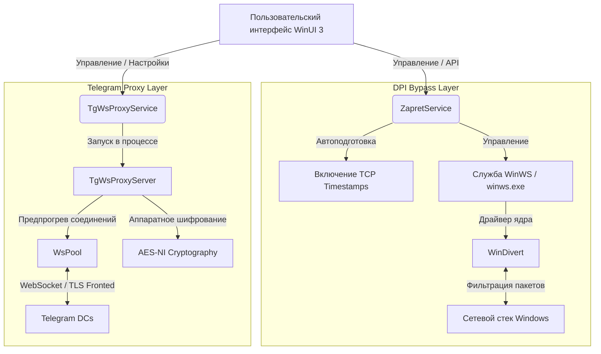

### 1. Движок обхода DPI
В качестве низкоуровневой основы используется утилита `winws.exe` (проект `zapret` разработчика bol-van):
* **Принцип перехвата:** Драйвер ядра `WinDivert` перехватывает сетевые пакеты на уровне сетевого интерфейса Windows.
* **Методы обхода:** Модификация TLS/TCP пакетов: фрагментация TLS ClientHello, изменение регистра полей HTTP-заголовков, манипуляции с размером окна TCP (TCP Window Size) и внедрение фейковых TLS SNI запросов (Fake TLS).
* **TCP Timestamps:** Приложение автоматически активирует временные метки TCP (`Tcp1323Opts`), устраняя проблемы несовместимости при сборке фрагментированных пакетов.

### 2. Локальный WebSocket-прокси для Telegram
Интегрированный C# прокси-сервер обеспечивает обход блокировок мессенджера:
* **Pre-warmed WebSocket Pool (`WsPool`):** Заранее создает и поддерживает пул открытых WebSocket-соединений к дата-центрам Telegram. Обмен данными начинается мгновенно без задержек на рукопожатия.
* **Аппаратное ускорение шифрования:** Потоковое шифрование пакетов использует векторные инструкции процессора AES-NI (`Aes.EncryptEcb`), минимизируя загрузку CPU.
* **SNI Fronting:** Трафик маскируется под доверенные веб-ресурсы и направляется через Cloudflare Workers, обходя блокировки протокола MTProto.

---

## Галерея интерфейса

<p align="center">
  <b>Главная панель управления (DPI Bypass Dashboard)</b><br/>
  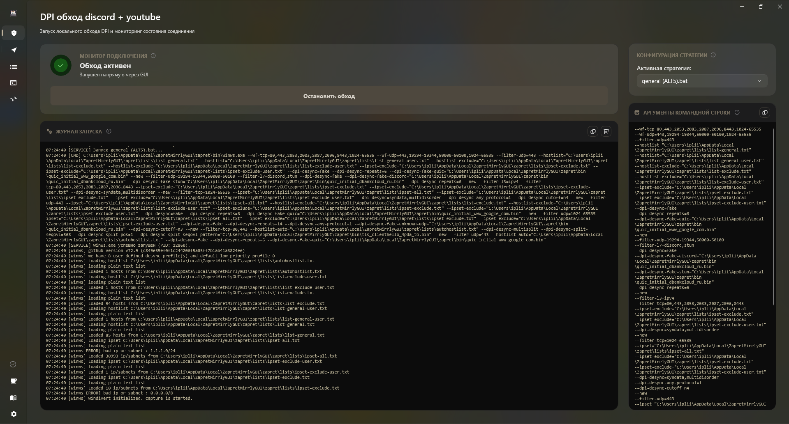
</p>

<p align="center">
  <b>Интегрированный Telegram-прокси (TgWsProxy)</b><br/>
  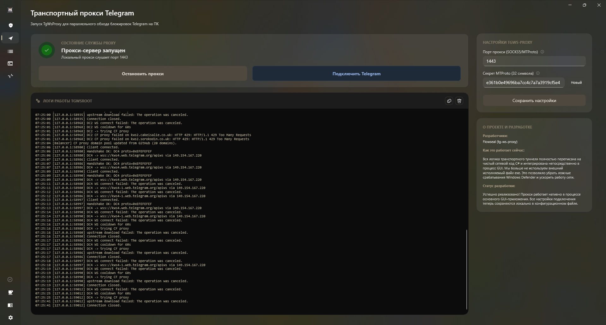
</p>

### Темы оформления и стеклянные подложки (WinUI 3)

<table align="center">
  <tr>
    <td align="center"><b>Светлая тема (Apple Light Glass)</b></td>
    <td align="center"><b>Тёмная тема (Acrylic Glass)</b></td>
  </tr>
  <tr>
    <td>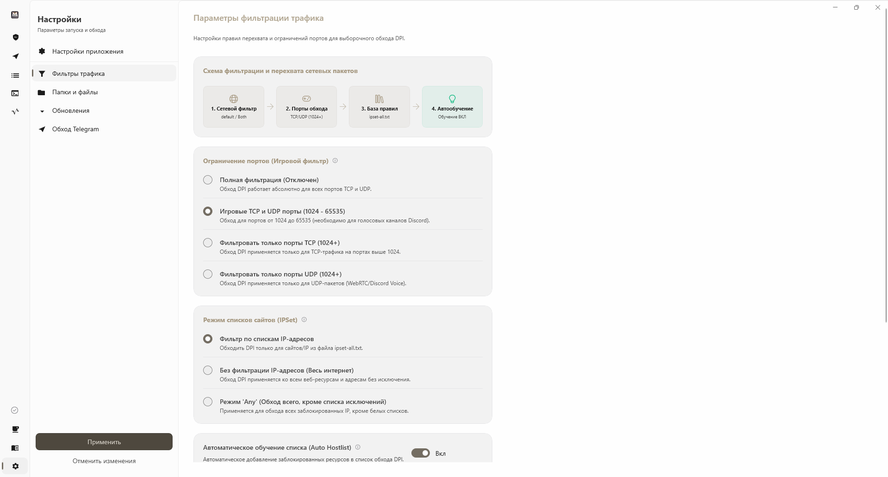</td>
    <td>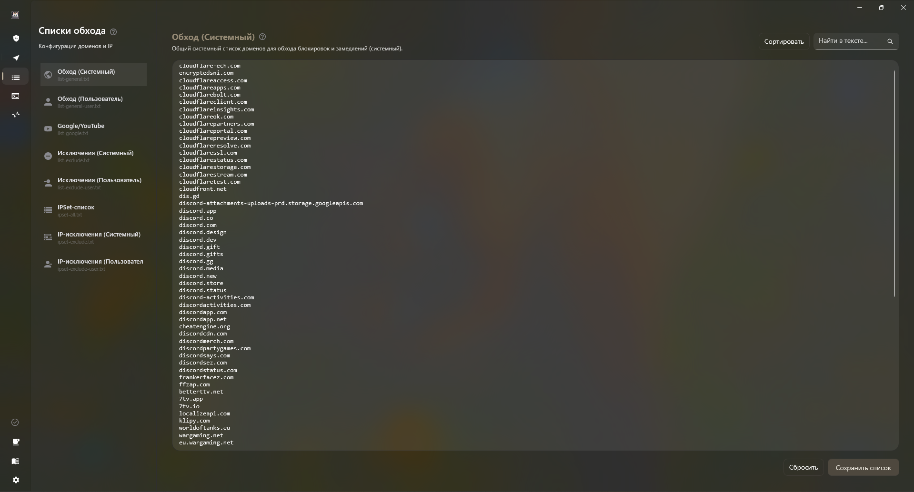</td>
  </tr>
  <tr>
    <td align="center"><b>Тёмная тема (Mica Backdrop)</b></td>
    <td align="center"><b>Тёмная тема (Стандартный стиль)</b></td>
  </tr>
  <tr>
    <td>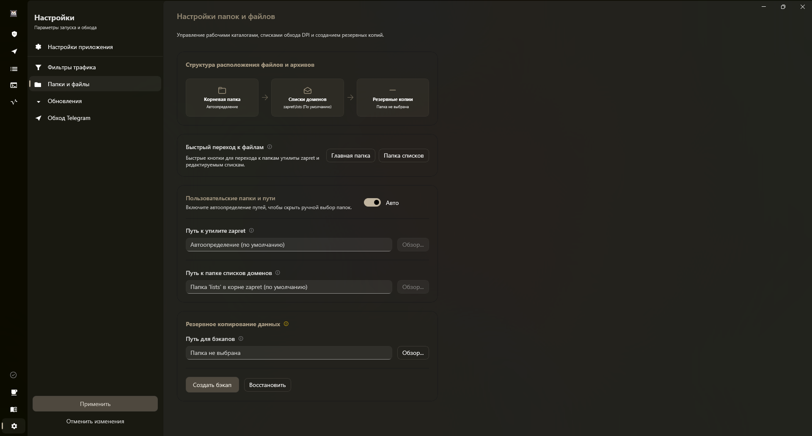</td>
    <td>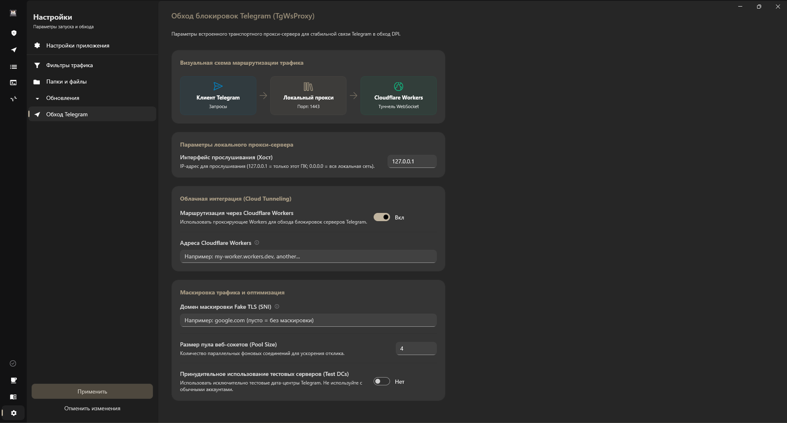</td>
  </tr>
</table>

### Диагностика, Настройки и Системный трей

<p align="center">
  <b>Модуль универсальной автодиагностики сети</b><br/>
  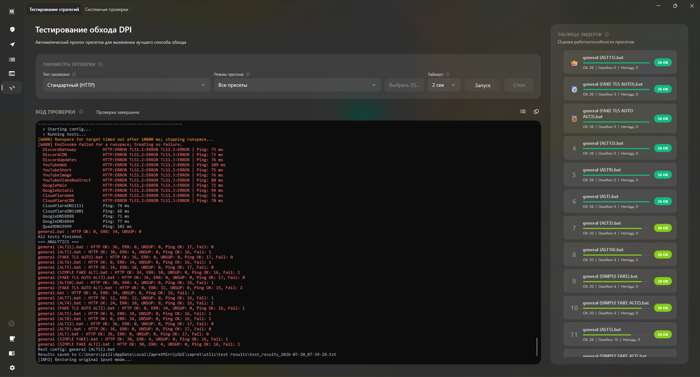
</p>

<table align="center">
  <tr>
    <td align="center"><b>Страница настроек</b></td>
    <td align="center"><b>Справка и обновления</b></td>
  </tr>
  <tr>
    <td>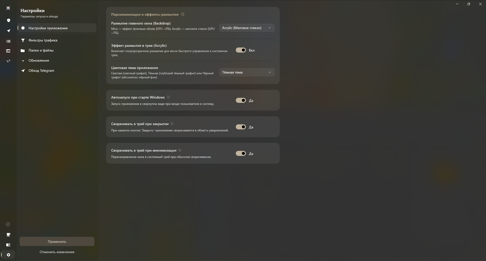</td>
    <td>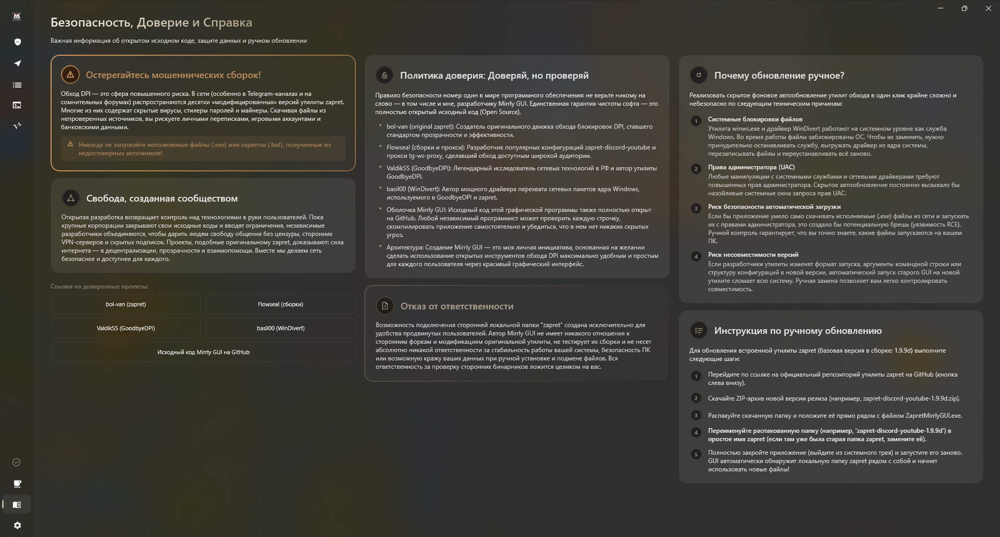</td>
  </tr>
  <tr>
    <td align="center"><b>Мониторинг логов winws</b></td>
    <td align="center"><b>Виджет и меню Трей (ЛКМ / ПКМ)</b></td>
  </tr>
  <tr>
    <td>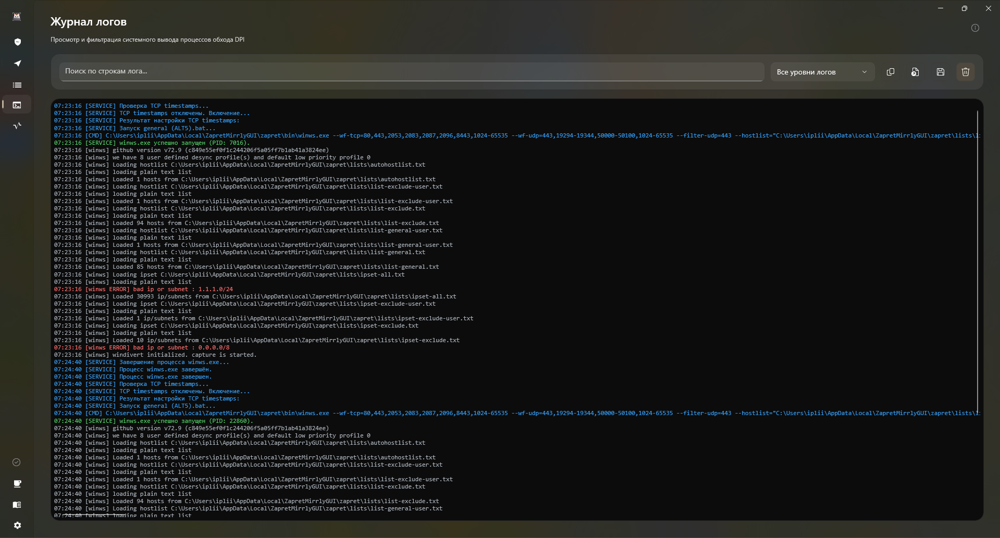</td>
    <td>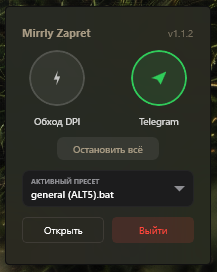 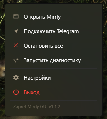</td>
  </tr>
</table>

---

## Системные требования

* **Операционная система:** Windows 10 (версия 1809 и новее) или Windows 11 (x64).
* **Права:** Администратор (необходимы для инсталляции службы автозапуска и драйвера `WinDivert`).
* **Совместимость:** Перед активацией обхода убедитесь, что другие утилиты на базе `WinDivert` (GoodbyeDPI, сторонние сборки zapret) остановлены.

---

## Быстрый запуск и настройка браузера

### 1. Запуск приложения
1. Скачайте последнюю версию `ZapretMirrlyGUI.exe` из раздела **[Releases](https://github.com/joycecurcirt539-dot/zapret-mirrly-gui/releases)**.
2. Запустите файл от имени Администратора.
3. На **Панели управления** выберите желаемый пресет.
4. Нажмите **«Запустить»** для разовой сессии или **«Установить службу»** для регистрации автозапуска в Windows.
5. Для Telegram: перейдите во вкладку **Telegram прокси**, запустите сервер и нажмите кнопку быстрого подключения.

### 2. Обязательные настройки браузера (для стабильного обхода YouTube)

> [!TIP]
> **1. Отключение протокола QUIC (HTTP/3):**
> Протокол QUIC работает поверх UDP и может передавать данные в обход TCP-модификаций `winws`. В браузерах на базе Chromium (Chrome, Yandex, Edge, Brave) откройте адрес `chrome://flags/#enable-quic` и переведите значение в **Disabled**.
>
> **2. Отключение Безопасного DNS (DNS over HTTPS / DoH):**
> Зашифрованный DNS в браузере может перенаправлять запросы в обход локальных DNS-фильтров. В настройках браузера (*Раздел «Конфиденциальность и безопасность» -> «Безопасный DNS»*) выберите использование системного DNS.

---

## Сборка из исходного кода

Для самостоятельной компиляции приложения необходимы следующие инструменты:
* **.NET 10.0 SDK** (или новее)
* **Windows 10 / 11 SDK** (сборка 10.0.26100.0 или новее)
* **Visual Studio 2022** (с компонентами *Разработка настраиваемых приложений для Windows / WinUI 3*) или **JetBrains Rider**

```bash
# 1. Клонирование репозитория
git clone https://github.com/joycecurcirt539-dot/zapret-mirrly-gui.git
cd zapret-mirrly-gui

# 2. Сборка проекта в конфигурации Release
dotnet build -c Release

# 3. Публикация портативного файла
dotnet publish -c Release -r win-x64 -o release
```

---

## Сравнение с альтернативами

| Функция / Возможность | Zapret Mirrly GUI | GoodbyeDPI | GoodbyeDPI GUI | Ручные `.bat` скрипты |
|:---|:---:|:---:|:---:|:---:|
| **Интерфейс WinUI 3 (Fluent/Mica)** | Да | Нет | Устаревший WinForms | Нет |
| **Системная служба (автозапуск)** | Да (1 клик) | Настройка вручную | Нет | Требует sc.exe |
| **Встроенный обход Telegram (C#)** | Да (AES-NI / WsPool) | Нет | Нет | Нет |
| **Интерактивная диагностика** | Да | Нет | Нет | Нет |
| **Цветовой журнал логов** | Да | Нет | Нет | Нет |
| **Редактор списков в приложении** | Да | Нет | Ограниченный | Нет |
| **Портативный формат (Single EXE)** | Да | Да | Да | Нет |

---

## Часто задаваемые вопросы (FAQ)

<details>
<summary><strong>YouTube или Discord всё равно тормозит/не работает. Что делать?</strong></summary>

1. Убедитесь, что приложение успешно запустилось с правами Администратора и в логах нет ошибок монтирования драйвера `WinDivert`.
2. Перейдите на вкладку **Диагностика** и запустите тест. Он покажет, на каком этапе происходит блокировка (DNS, пинг или HTTP-запрос).
3. Попробуйте выбрать другой пресет на панели управления. Провайдеры связи используют разные конфигурации DPI, поэтому универсального пресета не существует (кому-то подходит `FAKE TLS`, кому-то `SIMPLE FAKE` или `ALT`).
4. Убедитесь, что в браузере выключен протокол QUIC (`chrome://flags/#enable-quic`).
5. Убедитесь, что другие DPI-обходчики (GoodbyeDPI и др.) полностью остановлены и их процессы не висят в диспетчере задач.

</details>

<details>
<summary><strong>Зачем приложению права администратора?</strong></summary>

Низкоуровневая утилита `winws.exe` использует драйвер `WinDivert` для фильтрации и модификации пакетов на уровне сетевых интерфейсов Windows, а также регистрирует службу автозапуска в системе. Подобные операции разрешены только процессам с правами Администратора.

</details>

<details>
<summary><strong>Это безопасно? Куда уходит мой интернет-трафик?</strong></summary>

Программа работает **полностью локально**. В отличие от VPN, здесь нет внешних серверов, через которые перенаправляется ваш трафик. Утилита лишь перехватывает заголовки пакетов на вашем ПК, модифицирует их для обхода фильтров провайдера и сразу отправляет дальше. Код проекта открыт.

</details>

<details>
<summary><strong>В чём разница между этим обходом и классическим VPN?</strong></summary>

VPN шифрует весь ваш трафик и передает его через удаленный сервер, что часто приводит к снижению скорости и увеличению пинга. Zapret Mirrly GUI изменяет структуру отправляемых вами пакетов локально, поэтому скорость интернета остается максимальной.

</details>

<details>
<summary><strong>Почему исполняемый файл весит около 250 МБ?</strong></summary>

Приложение скомпилировано в режиме `Self-Contained`. Внутрь упакована полная среда выполнения .NET 10 Runtime, бинарные файлы `winws.exe` для различных систем, драйвер `WinDivert` и все встроенные ресурсы. Приложение полностью портативно и не требует предварительной установки .NET SDK на компьютере пользователя.

</details>

---

## Обратная связь и репорты об ошибках

Если вы обнаружили баг, столкнулись с проблемой или хотите предложить новую функцию:
1. Перейдите в раздел **[GitHub Issues](https://github.com/joycecurcirt539-dot/zapret-mirrly-gui/issues)**.
2. Нажмите **New Issue** и опишите возникшую проблему.
3. По возможности приложите вывод из вкладки **Логи** и результаты работы **Диагностики**.

---

## Зависимости и благодарности

Проект создавался на базе фундаментальных открытых разработок мирового сообщества и выражает искреннюю благодарность авторам за их вклад:

* **[bol-van (Vasily Levichev)](https://github.com/bol-van)** — автор и разработчик низкоуровневого движка обхода [zapret](https://github.com/bol-van/zapret) и консольной утилиты `winws.exe`.
* **[Flowseal](https://github.com/Flowseal)** — автор конфигурационных стратегий обхода [zapret-discord-youtube](https://github.com/Flowseal/zapret-discord-youtube) и концепта прокси-сервера [tg-ws-proxy](https://github.com/Flowseal/tg-ws-proxy).
* **[basil00 (WinDivert)](https://github.com/basil00/Divert)** — создатель драйвера ядра и библиотеки **WinDivert** (Windows Packet Divert) для перехвата сетевого трафика.
* **[ValdikSS (GoodbyeDPI)](https://github.com/ValdikSS)** — исследователь сетевых блокировок и автор проектов обхода DPI, чьи работы заложили основу для развития средств взаимодействия с WinDivert.
* **Microsoft Corporation** — авторы фреймворков WinUI 3, .NET Runtime и набора компонентов Windows App SDK & Windows Community Toolkit.

---

## Лицензия

Исходный код графической оболочки **Zapret Mirrly GUI** распространяется под свободной лицензией **MIT**. Полный текст доступен в файле [LICENSE](LICENSE).

### Лицензии сторонних компонентов и библиотек:
* **zapret / winws.exe** — (c) bol-van, распространяется под лицензией **MIT / GPL-3.0**.
* **WinDivert (WinDivert.dll / WinDivert64.sys)** — (c) basil00, распространяется под лицензиями **LGPL-3.0 / GPL-3.0**.
* **WinUI 3 & Windows App SDK** — (c) Microsoft Corporation, распространяются под лицензией **MIT**.
* **CommunityToolkit.WinUI** — (c) Microsoft / Windows Community Toolkit Contributors, лицензия **MIT**.
