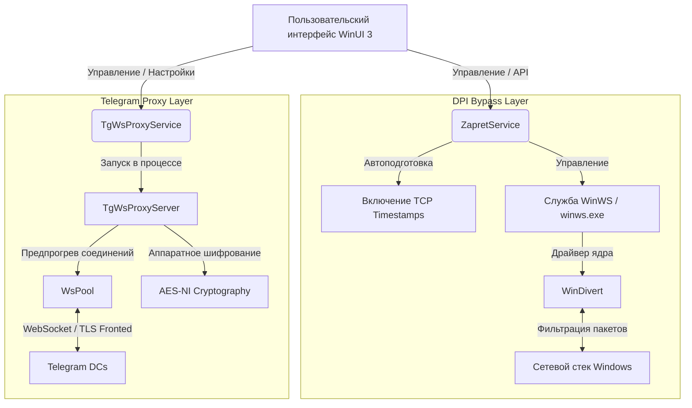
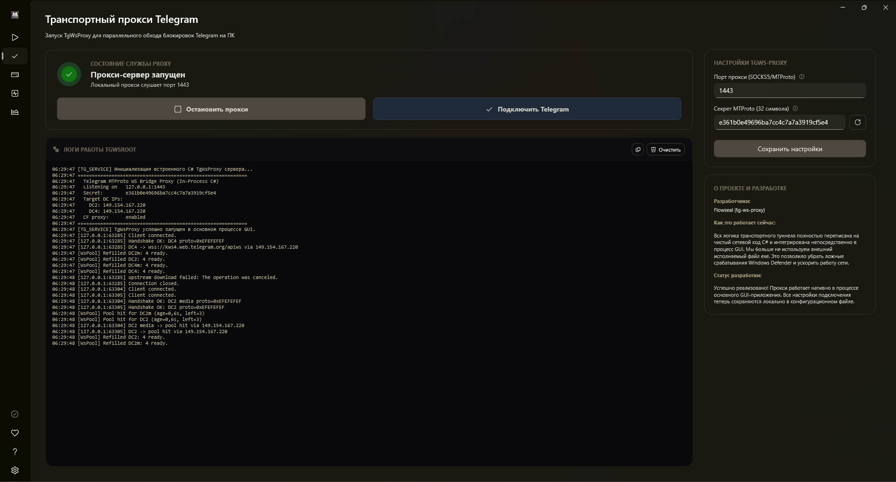

  

<h1 align="center">Zapret Mirrly GUI</h1>

  <b>Современное графическое решение (WinUI 3) для автоматического обхода DPI-блокировок YouTube, Discord и системного проксирования Telegram в один клик.</b>

  
  
  
  
  

  

> [!IMPORTANT]
> **Требуются права Администратора.** Для корректного монтирования драйвера ядра `WinDivert` и управления службами Windows приложению необходим повышенный уровень привилегий. При запуске программа автоматически запросит стандартное UAC-подтверждение.

---

## 📖 Содержание
1. [О проекте](#-о-проекте)
2. [Философия проекта: Доступность и Прозрачность](#-философия-проекта-доступность-и-прозрачность)
3. [Основные возможности](#-основные-возможности)
4. [Архитектура и технические детали](#-архитектура-и-технические-детали)
5. [Интерфейс и скриншоты](#-интерфейс-и-скриншоты)
6. [Системные требования](#-системные-требования)
7. [Быстрый запуск](#-быстрый-запуск)
8. [Сравнение с альтернативами](#-сравнение-с-альтернативами)
9. [Часто задаваемые вопросы (FAQ)](#-часто-задаваемые-вопросы-faq)
10. [Зависимости и благодарности](#-зависимости-и-благодарности)
11. [Лицензия](#-лицензия)

---

## 🌟 О проекте

**Zapret Mirrly GUI** — это развитая графическая оболочка, объединяющая возможности низкоуровневого DPI-обходчика `zapret` и специально спроектированного высокоскоростного Telegram-прокси. 

Проект решает главную проблему консольных утилит — сложность настройки и отсутствие обратной связи. Вместо редактирования конфигурационных файлов вручную и запуска разрозненных `.bat` скриптов, пользователь получает единую среду управления с интерактивной диагностикой, визуальным редактором правил и встроенным системным треем. Приложение работает полностью локально, сохраняя вашу конфиденциальность: весь трафик обрабатывается непосредственно на вашем ПК без отправки на внешние VPN-серверы.

---

## 🎯 Философия проекта: Доступность и Прозрачность

При проектировании **Zapret Mirrly GUI** мы руководствовались двумя ключевыми принципами: **максимальная простота для конечного пользователя** и **абсолютная наблюдаемость процессов «под капотом»**.

### 1. Доступность для каждого (Zero-Threshold UX)
Интерфейс приложения спроектирован так, чтобы им мог успешно пользоваться человек с любым уровнем компьютерной грамотности — будь то ребенок, пожилой человек (бабушка или дедушка) или тот, кто впервые видит операционную систему Windows:
* **Запуск в один клик:** Основной сценарий обхода не требует ввода консольных параметров или знания сетевых протоколов. Достаточно открыть программу и нажать одну кнопку «Запустить» или «Установить службу».
* **Умные настройки по умолчанию:** Все необходимые для работы драйверы, системные пути и стартовые конфигурации уже оптимизированы и настроены. Пользователь избавлен от необходимости принимать сложные технические решения при первом запуске.
* **Ничего лишнего:** В приложении нет перегруженных меню, рекламных баннеров или избыточных интерфейсных блоков. Каждый элемент управления находится на своем месте и выполняет строго отведенную ему задачу.

### 2. Бескомпромиссная информативность и отладка
Простота интерфейса не делает приложение «черным ящиком». Мы убеждены, что пользователь имеет право знать, как работает программа и почему возникает та или иная ошибка. Для этого в приложении реализован сквозной мониторинг:
* **Журналирование каждого шага:** Практически любое действие программы — от извлечения бинарных ресурсов и установки службы до сетевого пинга и смены состояния WebSocket-соединения — записывается в структурированный журнал.
* **Информативность вместо сухих ошибок:** Вместо невнятных системных кодов или внезапных вылетов приложение предоставляет подробные, понятные текстовые отчеты о возникших проблемах. Вы всегда сможете понять, мешает ли запуску сторонний антивирус, заблокирован ли порт другим процессом или провайдер сменил сигнатуру блокировки.
* **Инструменты для анализа:** Встроенная вкладка диагностики и цветной живой лог консольного вывода позволяют продвинутым пользователям или разработчикам быстро локализовать проблему и подобрать рабочую стратегию обхода без необходимости запускать сторонние анализаторы сетевого трафика.

---

## ✨ Основные возможности

* **Элегантный Fluent интерфейс:** Современный дизайн на базе WinUI 3 с полноценной поддержкой эффектов Mica и Acrylic, плавной анимацией интерфейса, автоматическим переключением темной/светлой тем и высокой плотностью компоновки элементов.
* **Управление Windows-службой:** Установка и удаление системной службы `winws` в один клик. Служба работает в фоновом режиме независимо от того, запущено ли само графическое окно приложения, обеспечивая автоматический обход блокировок сразу после загрузки ОС.
* **Автоматический запуск и работа в трее:** Приложение умеет сворачиваться в область уведомлений (системный трей). Из контекстного меню трея можно быстро включать/выключать обход, запускать диагностику или настраивать Telegram-прокси.
* **Интегрированный C# Telegram-прокси (TgWsProxy):** Встроенный в процесс GUI высокопроизводительный локальный прокси-сервер на чистом C# (.NET 10). Он заменяет оригинальный скрипт на Python, устраняя задержки, снижая потребление памяти и убирая ложные срабатывания антивирусов на PyInstaller.
* **Интерактивная диагностика:** Встроенный инструмент проверки доступности ресурсов (YouTube, Discord). Выполняет пошаговое тестирование: от разрешения DNS до реального получения заголовков HTTP, наглядно локализуя сетевую проблему.
* **Информативный журнал логов:** Вывод работы фоновых процессов `winws.exe` в реальном времени с интеллектуальным цветовым кодированием (красный — критические сбои драйвера, оранжевый — сетевые предупреждения, зеленый — успешные транзакции).
* **Встроенный редактор списков:** Управление файлами черных и белых списков доменов (`blacklist` / `whitelist`) прямо внутри приложения. Больше нет необходимости искать файлы конфигурации в проводнике.
* **Полная автономность (Self-Contained):** Один исполняемый файл `ZapretMirrlyGUI.exe` содержит в себе все зависимости, включая .NET Runtime, бинарники `winws.exe` (для x86/x64), библиотеки и драйвер ядра `WinDivert`.

---

## 🔬 Архитектура и технические детали

### 1. Движок обхода DPI
В качестве низкоуровневой основы используется утилита `winws.exe` (проект `zapret` разработчика bol-van):
* **Принцип перехвата:** Драйвер ядра `WinDivert` перехватывает сетевые пакеты на уровне сетевого интерфейса Windows.
* **Методы обхода:** Пакеты TLS/TCP подвергаются модификации: фрагментация TLS ClientHello, изменение регистра полей HTTP-заголовков (например, `host` -> `hOsT`), манипуляции с размером окна TCP (TCP Window Size) и внедрение фейковых TLS SNI запросов (Fake TLS). Это не позволяет сетевым анализаторам провайдера (DPI) распознавать целевые домены.
* **TCP Timestamps:** Приложение автоматически вносит изменения в системный реестр (`Tcp1323Opts`), активируя временные метки TCP. Это устраняет проблемы несовместимости при сборке фрагментированных пакетов веб-серверами.

### 2. Локальный WebSocket-прокси для Telegram
Интегрированный C# прокси-сервер обеспечивает обход блокировок мессенджера:
* **Pre-warmed WebSocket Pool (`WsPool`):** Сервер заранее создает и поддерживает пул открытых WebSocket-соединений к дата-центрам Telegram. Когда клиентское приложение Telegram отправляет запрос, обмен данными начинается мгновенно без затрат времени на TCP-подключение и TLS-рукопожатие.
* **Аппаратное ускорение шифрования:** Потоковое шифрование MTProto пакетов использует векторные инструкции процессора AES-NI (`Aes.EncryptEcb`), что минимизирует загрузку CPU даже при передаче тяжелых медиафайлов.
* **SNI Fronting:** Трафик маскируется под доверенные веб-ресурсы (например, SNI `sprinthost.ru` на этапе рукопожатия TLS) и направляется через Cloudflare Workers, обходя блокировки протокола MTProto.

---

## 📸 Интерфейс и скриншоты

Разделы графического интерфейса спроектированы в соответствии с гайдлайнами Windows Fluent Design и поддерживают динамические темы оформления (Acrylic/Mica).

### Панель управления и Telegram-прокси
Основной хаб управления процессами и настройки встроенного высокоскоростного WebSocket-моста для Telegram.

| Главный хаб управления | Вкладка Telegram прокси |
|:---:|:---:|
|  |  |
| *Запуск и остановка процессов обхода блокировок в один клик. Выбор пресетов конфигурации.* | *Управление WebSocket-мостом, предпрогревом сокетов, пулом доменов и генерация ссылки подключения.* |

### Диагностика, Логирование и Конфигурация
Встроенные инструменты для анализа сетевых узлов, просмотра вывода `winws.exe` и редактирования списков блокировки.

| Сетевая диагностика | Цветовой журнал логов |
|:---:|:---:|
|  |  |
| *Интерактивный тест доступности YouTube, Discord, DNS-серверов и пинга для выявления точек сбоя.* | *Вывод консольного вывода winws.exe в реальном времени с подсветкой ошибок и успешных операций.* |

| Редактор списков доменов | FAQ и Справка |
|:---:|:---:|
|  |  |
| *Визуальный редактор файлов черного и белого списков блокировки напрямую из графической оболочки.* | *Встроенный справочник по безопасности, локальной обработке пакетов и тонкой настройке утилиты.* |

### Системный трей и быстрое управление
Приложение поддерживает фоновую работу и компактно сворачивается в системный трей.

| Левый клик (Статус и управление) | Правый клик (Контекстное меню) |
|:---:|:---:|
|  |  |
| *Быстрый просмотр статуса служб и переключение состояний обхода.* | *Полный доступ к диагностике, настройкам Telegram и выходу.* |

---

## 🖥️ Системные требования

* **Операционная система:** Windows 10 (версия 1809 и новее) или Windows 11 (x64).
* **Права:** Администратор (необходимы для инсталляции службы автозапуска и драйвера `WinDivert`).
* **Совместимость:** Перед активацией обхода обязательно остановите другие службы, использующие драйвер `WinDivert` (например, GoodbyeDPI, сторонние сборки zapret), чтобы избежать сетевых конфликтов.

---

## 🚀 Быстрый запуск

1. Скачайте последнюю версию `ZapretMirrlyGUI.exe` из раздела **[Releases](https://github.com/joycecurcirt539-dot/zapret-mirrly-gui/releases)**.
2. Запустите файл от имени Администратора (или подтвердите автоматический запрос UAC).
3. На вкладке **Панель управления** выберите нужный пресет (например, `general (FAKE TLS AUTO).bat`).
4. Нажмите **«Запустить»** для ручной сессии или **«Установить службу»** для регистрации автозапуска службы в Windows.
5. Для Telegram: перейдите во вкладку **Telegram прокси**, нажмите кнопку запуска сервера, а затем кликните по кнопке быстрого подключения, чтобы автоматически привязать локальный прокси к вашему клиенту Telegram.

---

## ⚖️ Сравнение с альтернативами

| Функция / Возможность | Zapret Mirrly GUI | GoodbyeDPI | GoodbyeDPI GUI | Ручные `.bat` скрипты |
|:---|:---:|:---:|:---:|:---:|
| **Интерфейс WinUI 3 (Fluent/Mica)** | ✅ | ❌ | ⚠️ Устаревший WinForms | ❌ |
| **Системная служба (автозапуск)** | ✅ Установка в 1 клик | ⚠️ Настройка вручную | ❌ | ⚠️ Требует sc.exe вручную |
| **Встроенный обход Telegram (C#)** | ✅ (AES-NI / WsPool) | ❌ | ❌ | ❌ |
| **Интерактивная диагностика** | ✅ | ❌ | ❌ | ❌ |
| **Цветовой журнал логов** | ✅ | ❌ | ❌ | ❌ |
| **Редактор списков в приложении** | ✅ | ❌ | ⚠️ Ограниченный | ❌ |
| **Портативный формат (Single EXE)** | ✅ | ✅ | ✅ | ❌ |

---

## ❓ Часто задаваемые вопросы (FAQ)

<strong>YouTube или Discord всё равно тормозит/не работает. Что делать?</strong>

1. Убедитесь, что приложение успешно запустилось с правами Администратора и в логах нет ошибок монтирования драйвера `WinDivert`.
2. Перейдите на вкладку **Диагностика** и запустите тест. Он покажет, на каком этапе происходит блокировка (DNS, пинг или HTTP-запрос).
3. Попробуйте выбрать другой пресет на панели управления. Провайдеры связи используют разные конфигурации DPI, поэтому универсального пресета не существует (кому-то подходит `FAKE TLS`, кому-то `SIMPLE FAKE` или `ALT`).
4. Убедитесь, что другие DPI-обходчики (GoodbyeDPI и др.) полностью остановлены и их процессы не висят в диспетчере задач.

<strong>Зачем приложению права администратора?</strong>

Низкоуровневая утилита `winws.exe` использует драйвер `WinDivert` для фильтрации и модификации пакетов на уровне сетевых интерфейсов Windows, а также регистрирует службу автозапуска в системе. Подобные операции в целях безопасности Windows разрешены только процессам, запущенным с правами Администратора.

<strong>Это безопасно? Куда уходит мой интернет-трафик?</strong>

Программа работает **полностью локально**. В отличие от VPN, здесь нет внешних серверов, через которые перенаправляется ваш трафик. Утилита лишь перехватывает заголовки пакетов на вашем ПК, модифицирует их для обхода фильтров провайдера и сразу отправляет дальше. Код проекта открыт, вы можете самостоятельно собрать его из исходников.

<strong>В чём разница между этим обходом и классическим VPN?</strong>

VPN шифрует весь ваш трафик и передает его через удаленный сервер, что часто приводит к снижению скорости, увеличению пинга и риску утечки данных на стороне владельца сервера. Zapret Mirrly GUI изменяет структуру отправляемых вами пакетов локально, поэтому скорость интернета остается максимальной (ограничена только тарифом вашего провайдера).

<strong>Почему исполняемый файл весит около 300 МБ?</strong>

Приложение скомпилировано в режиме `Self-Contained`. Это означает, что внутрь исполняемого файла упакована полная среда выполнения .NET 10 Runtime, бинарные файлы `winws.exe` для разных архитектур, драйвер `WinDivert` и все конфигурации. Благодаря этому приложение является полностью портативным и запустится на любом компьютере без необходимости скачивать и устанавливать библиотеки от Microsoft.

---

## 🤝 Зависимости и благодарности

Проект существует благодаря открытым разработкам сообщества:
* **[bol-van](https://github.com/bol-van)** — автор низкоуровневого движка обхода [zapret](https://github.com/bol-van/zapret) и утилиты `winws`.
* **[Flowseal](https://github.com/Flowseal)** — создатель популярных конфигураций обхода [zapret-discord-youtube](https://github.com/Flowseal/zapret-discord-youtube) и концепта прокси-сервера [tg-ws-proxy](https://github.com/Flowseal/tg-ws-proxy).
* **[basil00 (WinDivert)](https://github.com/basil00/Divert)** — разработчик драйвера и библиотеки **WinDivert** (Windows Packet Divert) для перехвата пакетов в пользовательском режиме.

---

## 📄 Лицензия

Этот проект распространяется под свободной лицензией **MIT**. Подробности в файле [LICENSE](LICENSE).
