<div align="center">


# Zapret Mirrly GUI для Windows

**Современное графическое решение (WinUI 3 / .NET 10) для автоматического обхода DPI-блокировок YouTube, Discord и системного проксирования Telegram (TgWsProxy) в один клик без системного VPN**

[-1E293B?logo=windows&logoColor=0078D6)](https://www.microsoft.com/windows)
[](https://dotnet.microsoft.com)
[](https://docs.microsoft.com/dotnet/csharp/)
[-1E293B?logo=windows&logoColor=005A9E)](https://learn.microsoft.com/windows/apps/winui/winui3/)
[](https://reqcrypt.org/windivert.html)
[](https://github.com/Flowseal/zapret-discord-youtube)
[](https://cloudflare.com)
<br/>
[](https://github.com/joycecurcirt539-dot/zapret-mirrly-gui/releases)
[](CHANGELOG.md)
[](https://github.com/joycecurcirt539-dot/zapret-mirrly-gui/releases)
[](https://github.com/joycecurcirt539-dot/zapret-mirrly-gui/stargazers)
[](https://github.com/joycecurcirt539-dot/zapret-mirrly-gui/issues)
<br/>
[](https://t.me/WhyOkyHb)
[](#16-безопасность-и-проверка-целостности)
[](https://github.com/joycecurcirt539-dot/zapret-mirrly-gui/releases/latest)
[](CHANGELOG.md)
[](LICENSE)

*Интеллектуальная маршрутизация и десинхронизация пакетов DPI (zapret winws), нативный движок TgWsProxy (.NET 10 / AES-NI / WsPool) и интеграция со стратегиями Flowseal 1.10.2. Полная автономность (Self-Contained) без необходимости установки сторонних рантаймов и без перенаправления пользовательского трафика на внешние VPN-серверы.*

<br/>

<picture>
  <source media="(prefers-color-scheme: dark)" srcset="https://github.com/joycecurcirt539-dot/zapret-mirrly-gui/blob/output/github-contribution-grid-snake-dark.svg?raw=true">
  <source media="(prefers-color-scheme: light)" srcset="https://github.com/joycecurcirt539-dot/zapret-mirrly-gui/blob/output/github-contribution-grid-snake.svg?raw=true">
  
</picture>

---

</div>

## Оглавление

1. [Планы развития и позиция автора](#планы-развития-и-позиция-автора)
2. [Что такое Zapret Mirrly GUI](#1-что-такое-zapret-mirrly-gui)
3. [Технический принцип работы](#2-технический-принцип-работы)
4. [Архитектура системы](#3-архитектура-системы)
5. [Ключевые возможности и модули](#4-ключевые-возможности-и-модули)
6. [Обзор пресетов и стратегий обхода (v1.10.2)](#5-обзор-пресетов-и-стратегий-обхода-v1102)
7. [Галерея интерфейса](#6-галерея-интерфейса)
8. [Быстрый старт и установка](#7-быстрый-старт-и-установка)
9. [Конфигурация и параметры](#8-конфигурация-и-параметры)
10. [Создание и настройка личного Cloudflare Worker](#9-создание-и-настройка-личного-cloudflare-worker)
11. [Мобильное приложение Mirrly TG Proxy для Android](#10-мобильное-приложение-mirrly-tg-proxy-для-android)
12. [Структура проекта и сборка из исходного кода](#11-структура-проекта-и-сборка-из-исходного-кода)
13. [Сравнение с альтернативами](#12-сравнение-с-альтернативами)
14. [График активности разработки](#13-график-активности-разработки)
15. [Динамика звезд репозитория](#14-динамика-звезд-репозитория)
16. [Хронология развития](#15-хронология-развития)
17. [Безопасность и проверка целостности](#16-безопасность-и-проверка-целостности)
18. [Благодарности и экосистема Mirrly](#17-благодарности-и-экосистема-mirrly)

---

## Планы развития и позиция автора

> [!NOTE]
> ### Экосистема Mirrly: Десктоп и Мобильные устройства
> Проект **Zapret Mirrly GUI** развивается в синергии с мобильным клиентом **[Mirrly TG Proxy для Android](https://github.com/joycecurcirt539-dot/Mirrly-TG-Proxy)**. Обе утилиты используют единый протокольный фундамент маскировки WebSocket/Anycast и позволяют настроить сквозной доступ к контенту без VPN на любых ваших устройствах.

> [!TIP]
> ### Автоматический подбор стратегий (Auto Preset Benchmark)
> В активной разработке находится интеллектуальный модуль автодиагностики: приложение отправляет тестовые пакеты через все доступные пресеты (`ALT1`–`ALT13`, `EXP`, `FAKE TLS`, `SIMPLE FAKE`) к пулу узлов YouTube/Discord и автоматически выбирает наилучшую конфигурацию для вашего интернет-провайдера.

> [!IMPORTANT]
> ### Принципы открытости и бесплатности
> * Приложение навсегда остается бесплатным: без рекламы, платных подписок и ограничений функционала.
> * Никакой скрытой телеметрии: обработка трафика происходит строго локально на вашем ПК.

---

## 1. Что такое Zapret Mirrly GUI

**Zapret Mirrly GUI** — мощное и удобное Windows-приложение на базе WinUI 3, объединяющее передовые возможности низкоуровневого DPI-обходчика `zapret` (актуальные стратегии Flowseal v1.10.2) и высокопроизводительного C# WebSocket-прокси для Telegram.

Вместо запуска разрозненных `.bat` файлов и ручной правки списков, пользователь получает готовую экосистему с управлением службой автозапуска Windows, интеллектуальной диагностикой, редактором доменов и информативным треем.

### Что умеет приложение:

* **Полный обход DPI для YouTube и Discord**: десинхронизация пакетов, FakeTLS, multisplit и обход блокировок видеопотоков (GVT/Googlevideo) и голосовых серверов Discord (UDP/STUN).
* **Встроенный Telegram WS Proxy (TgWsProxy)**: локальный MTProto/SOCKS5 прокси-сервер на чистом C# (.NET 10) с поддержкой Anycast пулов (20 узлов), ротацией Cloudflare Workers и аппаратным шифрованием AES-NI.
* **Управление службой Windows в 1 клик**: установка, запуск, остановка и чистое удаление системной службы `winws` через нативные Win32 Service API без `sc.exe`.
* **Актуальная база пресетов Flowseal 1.10.2**: полная поддержка новых стратегий `ALT13`, `general (EXP)`, `ALT1`–`ALT12`, `FAKE TLS AUTO`, `SIMPLE FAKE`, `GameFilter`.
* **Интерактивная диагностика**: автоматическая проверка драйвера WinDivert, сетевых служб (BFE, DNS), доступности ключевых веб-ресурсов и выявление типа DPI-блокировки.
* **Трей-менеджер нового поколения**: быстрое меню по левому клику (виджет статуса) и расширенное контекстное меню по правому клику.
* **Полная портативность (Single-File EXE)**: все компоненты (среда .NET 10, драйвер `WinDivert`, бинарники `winws.exe`, списки) упакованы в один файл.

---

## 2. Технический принцип работы

Приложение объединяет два независимых контура маршрутизации трафика:

```
+-----------------------------------------------------------------------------------------------+
| Компьютер пользователя (Windows 10 / 11)                                                     |
|                                                                                               |
|  [Браузер / Discord] ----(Прямой трафик TCP/UDP 80, 443, 19294+)----------------+             |
|                                                                                 |             |
|                                                                                 v             |
|  [Сетевой стек Windows] <====(Перехват и модификация)===> [WinDivert.sys]                     |
|                                                                  ^                            |
|                                                                  |                            |
|                                                         [winws.exe (zapret)]                  |
|                                                          Десинхронизация:                     |
|                                                          - FakeTLS / TLS Split / MultiSplit   |
|                                                          - HTTP Fake / QUIC Desync            |
|                                                          - Fake STUN / UDP Payloads           |
|                                                                                               |
|  [Клиент Telegram] ----(127.0.0.1:1080 / MTProto)---->[TgWsProxy (.NET 10)]                   |
|                                                              | WSS TLS (Port 443)             |
|                                                              v                                |
+--------------------------------------------------------------|--------------------------------+
                                                               |
                                                               v
+-----------------------------------------------------------------------------------------------+
| Сеть Cloudflare Anycast CDN (300+ дата-центров) / Личный Cloudflare Worker                   |
|                                                                                               |
|  [Cloudflare Edge Node] <------------------------------------+                                |
+------------------------------|----------------------------------------------------------------+
                               | TCP (443 / 80)
                               v
+-----------------------------------------------------------------------------------------------+
| Серверы Telegram (DC1 - DC5)                                                                  |
+-----------------------------------------------------------------------------------------------+
```

### Ключевые архитектурные принципы:

1. **Kernel-level перехват (WinDivert)**: сетевые пакеты перехватываются на уровне NDIS-драйвера до их отправки в канал провайдера.
2. **Нулевой оверхед по скорости**: в отличие от VPN, где весь объем данных шифруется и передается через сторонний сервер, `winws` модифицирует лишь стартовые пакеты сетевого рукопожатия (ClientHello / SYN). Весь полезный поток данных идет напрямую от провайдера на полной скорости тарифа.
3. **Аппаратная оптимизация TgWsProxy**: использование встроенных инструкций процессора AES-NI для потокового шифрования MTProto-трафика без задержек.

---

## 3. Архитектура системы

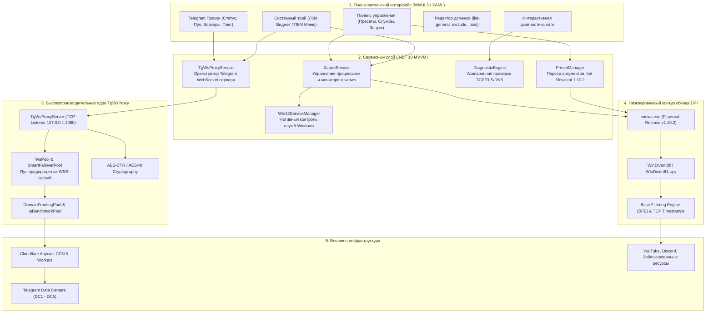
```mermaid
flowchart TD
    subgraph UILayer ["1. Пользовательский интерфейс (WinUI 3 / XAML)"]
        Dashboard["Панель управления (Пресеты, Службы, Запуск)"]
        TgWsProxyUI["Telegram Прокси (Статус, Пул, Воркеры, Пинг)"]
        DiagnosticsUI["Интерактивная диагностика сети"]
        ListsUI["Редактор доменов (list-general, exclude, ipset)"]
        TrayUI["Системный трей (ЛКМ Виджет / ПКМ Меню)"]
    end

    subgraph ServiceLayer ["2. Сервисный слой (.NET 10 MVVM)"]
        ZapretSvc["ZapretService<br/>Управление процессами и мониторинг winws"]
        PresetMgr["PresetManager<br/>Парсер аргументов .bat Flowseal 1.10.2"]
        Win32Svc["Win32ServiceManager<br/>Нативный контроль служб Windows"]
        DiagEngine["DiagnosticEngine<br/>Асинхронная проверка TCP/TLS/DNS"]
        TgWsSvc["TgWsProxyService<br/>Оркестратор Telegram WebSocket сервера"]
    end

    subgraph TgWsEngine ["3. Высокопроизводительное ядро TgWsProxy"]
        TgServer["TgWsProxyServer (TCP Listener 127.0.0.1:1080)"]
        WsPoolEngine["WsPool & SmartFailoverPool<br/>Пул предпрогретых WSS-сессий"]
        FrontingPool["DomainFrontingPool & IpBenchmarkPool"]
        CryptoEngine["AES-CTR / AES-NI Cryptography"]
    end

    subgraph KernelLayer ["4. Низкоуровневый контур обхода DPI"]
        WinwsProc["winws.exe (Flowseal Release v1.10.2)"]
        WinDivertDrv["WinDivert.dll / WinDivert64.sys"]
        WindowsBFE["Base Filtering Engine (BFE) & TCP Timestamps"]
    end

    subgraph RemoteInfra ["5. Внешняя инфраструктура"]
        CloudflareEdge["Cloudflare Anycast CDN & Workers"]
        TelegramDCs["Telegram Data Centers (DC1 - DC5)"]
        TargetWeb["YouTube, Discord, Заблокированные ресурсы"]
    end

    Dashboard --> ZapretSvc
    Dashboard --> PresetMgr
    TgWsProxyUI --> TgWsSvc
    DiagnosticsUI --> DiagEngine
    TrayUI --> ZapretSvc
    TrayUI --> TgWsSvc

    ZapretSvc --> WinwsProc
    ZapretSvc --> Win32Svc
    PresetMgr --> WinwsProc
    WinwsProc --> WinDivertDrv
    WinDivertDrv --> WindowsBFE
    WindowsBFE --> TargetWeb

    TgWsSvc --> TgServer
    TgServer --> CryptoEngine
    TgServer --> WsPoolEngine
    WsPoolEngine --> FrontingPool
    FrontingPool --> CloudflareEdge
    CloudflareEdge --> TelegramDCs
```

---

## 4. Ключевые возможности и модули

### 🎨 Современный Fluent-интерфейс (WinUI 3)
* **Нативные эффекты DWM**: поддержка подложек Mica, Acrylic и Apple Light Glass с авто-синхронизацией темной и светлой тем Windows.
* **Высокая плотность компоновки**: продуманное расположение элементов управления без лишних пустых пространств.
* **Zero-Lag анимации**: аппаратное ускорение рендеринга XAML через Direct3D 12.

### 🛡️ Интегрированный C# Telegram-прокси (TgWsProxy)
* **Асинхронная архитектура на Task/ValueTask**: нулевые блокировки UI-потока при обслуживании сотен одновременных медиа-потоков.
* **Система интеллектуальных пулов (`WsPool`)**: поддержание предпрогретых соединений к серверам Telegram для мгновенного старта воспроизведения видео и голосовых сообщений.
* **Балансировка и Failover (`SmartFailoverPool`)**: автоматический мониторинг задержек (RTT ping) к DC2 и DC4, детектирование ошибок HTTP 429 и прозрачное переключение узлов.
* **Поддержка личных Cloudflare Workers**: возможность использования персонального домена для 100% изоляции квоты и максимальной конфиденциальности.

### ⚡ Полная интеграция с Flowseal Zapret v1.10.2
* **Новейшая стратегия `ALT13`**: стандартный `ip_id` режим для сервисов Google и оптимизированные фейки для Discord и стриминга.
* **Экспериментальный профиль `general (EXP)`**: расширенный multisplit с сегментацией ClientHello.
* **Game Filter (Игровой фильтр)**: исключение портов популярных онлайн-игр (CS2, Dota 2, Valorant, Apex Legends) для исключения скачков пинга.
* **Режим автообучения (`autohostlist`)**: динамический перехват заблокированных сайтов «на лету» без модификации остального трафика.

### 🔍 Комплексная диагностика сети
* **Анализ системного окружения**: проверка состояния службы BFE (Base Filtering Engine), статуса TCP Timestamps, блокировок драйвера `WinDivert`.
* **Тестирование доступности сервисов**: пошаговый опрос DNS, TCP Handshake, TLS 1.2/1.3 к серверам YouTube, Discord Gateway, Telegram Web.

---

## 5. Обзор пресетов и стратегий обхода (v1.10.2)

| Пресет | Метод десинхронизации | Основное назначение |
| :--- | :--- | :--- |
| **`general (ALT13).bat`** | `ip_id=zero` для Google + `fake/hostfakesplit` | **Рекомендуемый.** Новейшая стратегия для стабильного YouTube 4K и голосовых каналов Discord. |
| **`general (ALT1) ... (ALT12).bat`** | Различные комбинации `fake`, `split2`, `disorder2`, `multisplit` | Альтернативные стратегии под особенности оборудования разных провайдеров (Ростелеком, Дом.ru, МТС, Билайн, Т2). |
| **`general (EXP).bat`** | Экспериментальный `multisplit` с новыми бинарными фейками | Профиль для провайдеров со сложными комбинированными алгоритмами ТСПУ/DPI. |
| **`general (FAKE TLS AUTO).bat`** | Автоматическая генерация фейкового TLS ClientHello | Универсальный профиль для магистральных провайдеров. |
| **`general (SIMPLE FAKE).bat`** | Базовая отправка фейкового пакета без фрагментации | Минимальная нагрузка на процессор для провайдеров с простыми DPI-фильтрами. |
| **`GameFilter (TCP / UDP)`** | Выборочная фильтрация портов > 1024 | Защита от перехвата пакетов онлайн-игр и голосовых протоколов (Discord WebRTC). |

---

## 6. Галерея интерфейса

<div align="center">

| Главная панель (Панель управления DPI) | Telegram WS Proxy |
| :-: | :-: |
| 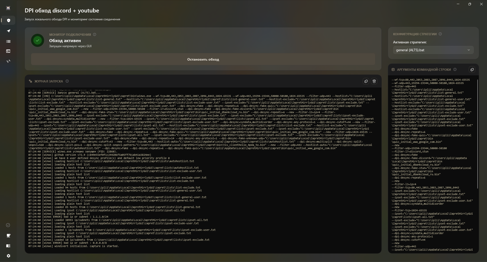 | 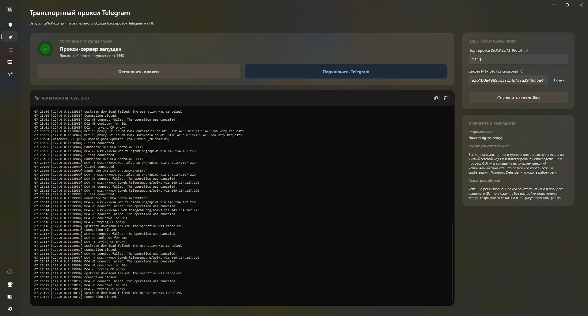 |

<br/>

| Модуль автодиагностики | Журнал логов winws в реальном времени |
| :-: | :-: |
| 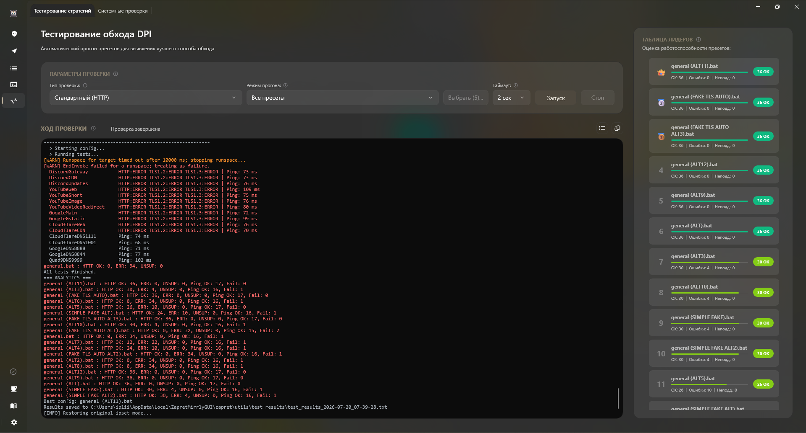 | 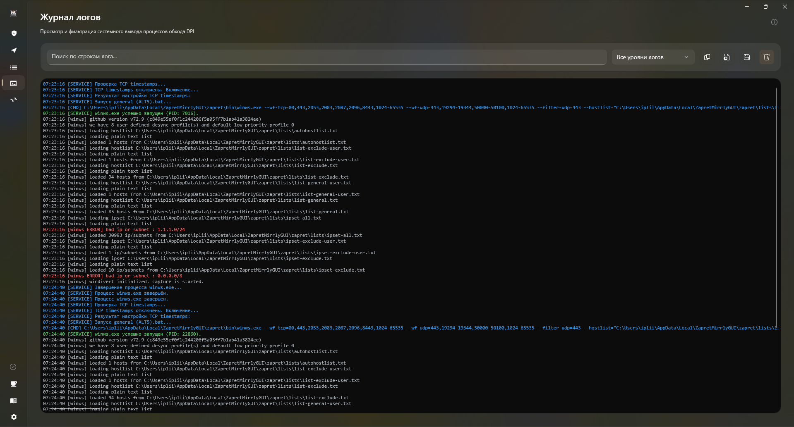 |

<br/>

| Настройки приложения | Справка и центр обновлений |
| :-: | :-: |
| 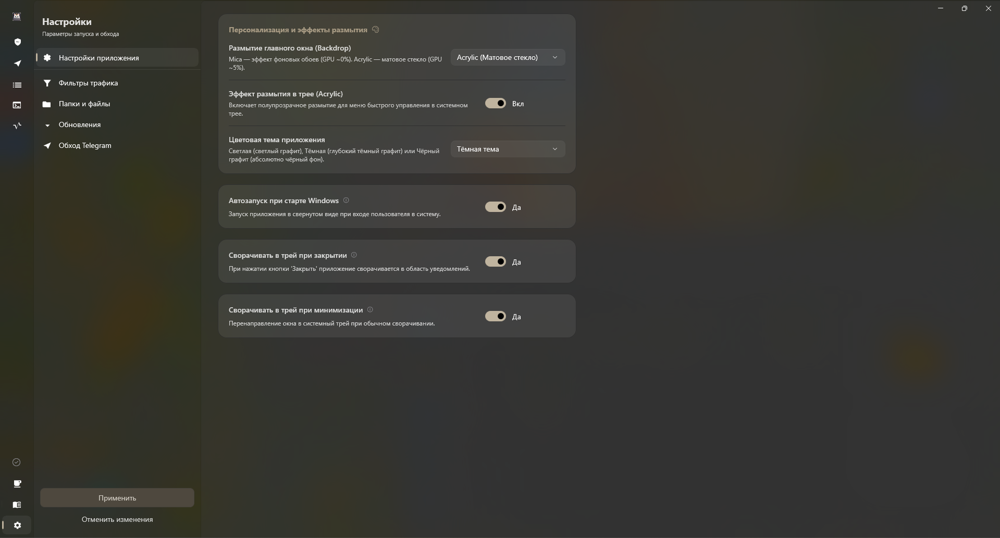 | 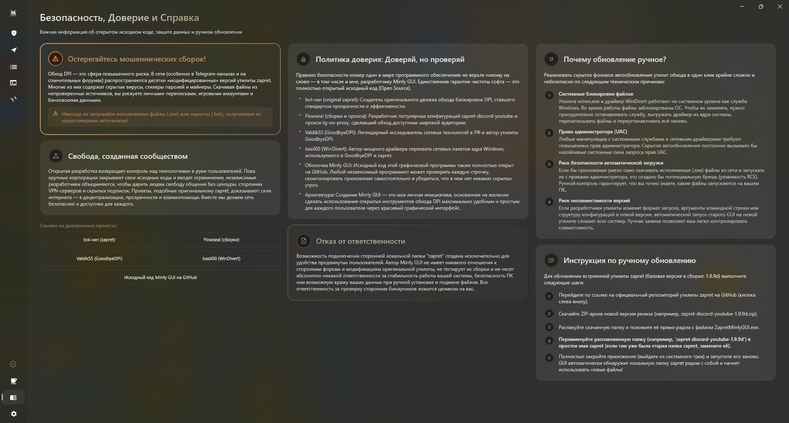 |

<br/>

| Темы оформления: Светлая (Light Glass) | Темы оформления: Тёмная (Mica Backdrop) |
| :-: | :-: |
| 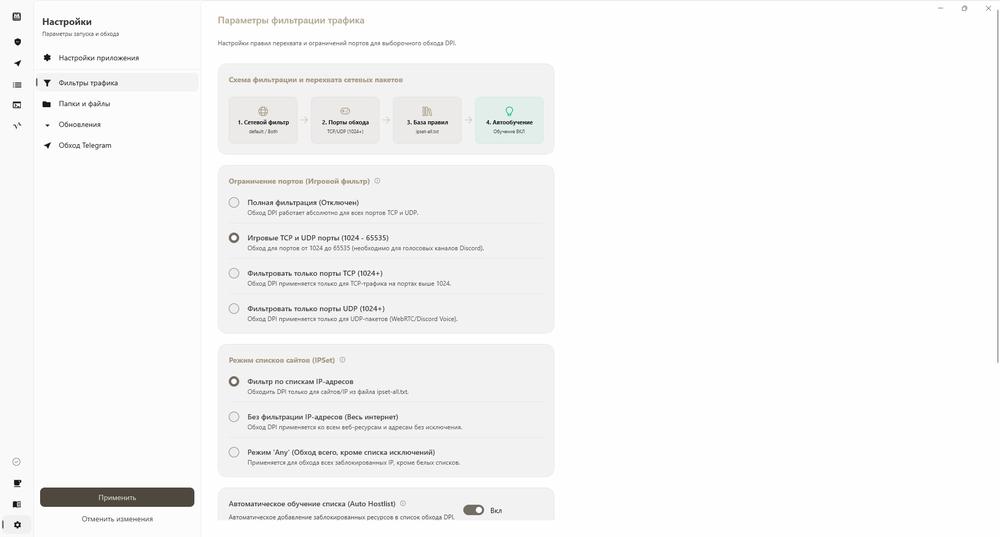 | 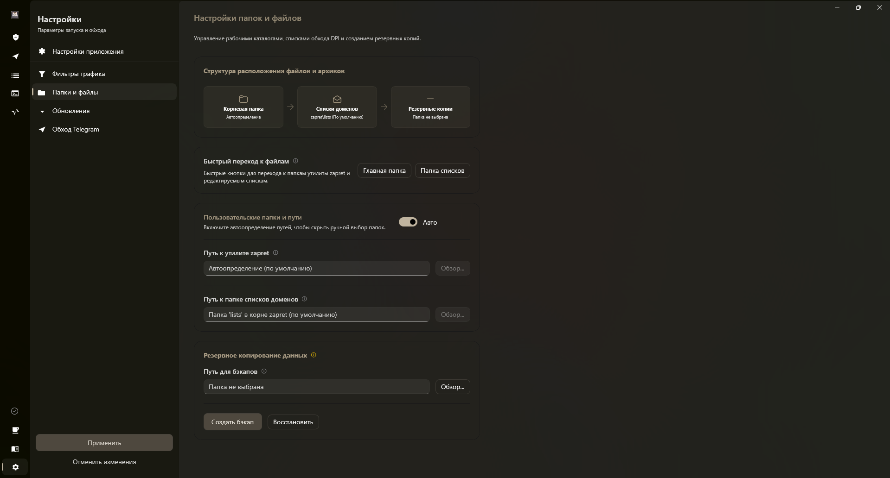 |

<br/>

| Виджет трея (ЛКМ) | Меню трея (ПКМ) |
| :-: | :-: |
| 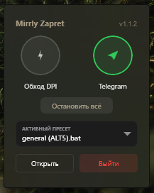 | 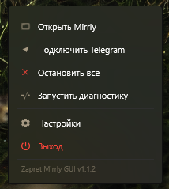 |

</div>

---

## 7. Быстрый старт и установка

1. Скачайте последнюю версию **`ZapretMirrlyGUI.exe`** из раздела **[Релизы GitHub](https://github.com/joycecurcirt539-dot/zapret-mirrly-gui/releases/latest)**.
2. Запустите файл (приложение автоматически запросит права Администратора для загрузки драйвера `WinDivert`).
3. Выберите желаемый пресет (по умолчанию рекомендуется **`general (ALT13).bat`** или **`general (ALT11).bat`**).
4. Нажмите **«Запустить»** для тестового запуска или **«Установить службу»**, чтобы обход работал автоматически при старте Windows.
5. Для работы Telegram: откройте вкладку **TgWsProxy**, запустите сервер и нажмите **«Подключить в Telegram»**.

> [!TIP]
> ### Настройки браузера для YouTube:
> 1. **Отключите протокол QUIC (HTTP/3)**: в Chromium-браузерах перейдите по адресу `chrome://flags/#enable-quic` и установите **Disabled**.
> 2. **Используйте безопасный DNS (DoH)**: в настройках браузера включите DNS over HTTPS (например, `https://dns.google/dns-query` или `https://1.1.1.1/dns-query`), так как стандартные DNS-запросы могут блокироваться провайдером.

---

## 8. Конфигурация и параметры

| Параметр | По умолчанию | Описание |
| :--- | :--- | :--- |
| `ActivePreset` | `general (ALT13).bat` | Активный файл конфигурации стратегии zapret |
| `GameFilterMode` | `disabled` | Режим фильтрации игровых портов (`disabled`, `all`, `tcp`, `udp`) |
| `ThemeMode` | `Dark` | Тема интерфейса (`Dark`, `Light`, `Black Graphite`) |
| `BackdropType` | `Mica` | Эффект прозрачности подложки (`Mica`, `Acrylic`, `None`) |
| `BindInterface` | `default` | Сетевой интерфейс для привязки перехвата WinDivert |
| `TgProxyPort` | `1080` | Локальный порт встроенного Telegram WebSocket прокси |
| `TgProxySecret` | генерируется | 34-символьный MTProto-секрет с маскировкой FakeTLS (`dd`) |
| `TgCustomWorker` | `""` | Домен персонального Cloudflare Worker для Telegram |
| `AutostartWithWindows` | `false` | Автозапуск GUI-оболочки при входе пользователя в систему |

---

## 9. Создание и настройка личного Cloudflare Worker

Создание персонального воркера для TgWsProxy занимает 1 минуту и дает персональный лимит в **100 000 запросов в сутки**:

1. Зарегистрируйтесь на [dash.cloudflare.com](https://dash.cloudflare.com/).
2. Перейдите в **Workers & Pages** ➔ **Create application** ➔ **Create Worker**.
3. Задайте имя воркера и нажмите **Deploy**.
4. Нажмите **Edit code**, вставьте скрипт воркера с поддержкой `cloudflare:sockets` и нажмите **Deploy**.
5. Скопируйте полученный домен (например: `my-proxy.user.workers.dev`).
6. В **Zapret Mirrly GUI** перейдите на вкладку **TgWsProxy**, вставьте домен в поле *«Личный Cloudflare Worker»* и перезапустите прокси.

---

## 10. Мобильное приложение Mirrly TG Proxy для Android

Для пользователей мобильных устройств на Android разработано отдельное нативное приложение **[Mirrly TG Proxy](https://github.com/joycecurcirt539-dot/Mirrly-TG-Proxy)**. Больше не нужно настраивать сложные связки с Tailscale и держать домашний ПК включенным!

```mermaid
flowchart LR
    TGApp["Telegram (Android)<br/>Официальный / AyuGram / Plus"] -->|Локальный сокет (127.0.0.1:1443 / 10808)| Engine["mirrlyengine (Rust Core)<br/>Tokio / Zero-Copy / FakeTLS"]
    Engine -->|WSS TLS 1.3 / cloudflare:sockets| CFEdge["Cloudflare Anycast CDN (300+ DC)"]
    CFEdge -->|Защищенный TCP| TGServers["Серверы Telegram (DC1-DC5)"]
```

### Ключевые особенности Mirrly TG Proxy:
* **100% Rust Core (`mirrlyengine`)**: Высочайшая скорость, epoll, Zero-Copy буферизация, отсутствие пауз JVM Garbage Collector.
* **Без системного VPN**: Работает как локальный шлюз `127.0.0.1`, не расходует батарею глобальным туннелем и не перехватывает трафик других приложений.
* **2 протокола**: MTProto (1443, FakeTLS `ee`/`dd`, Anycast CDN Flowseal) для чатов и 4K медиа + SOCKS5 (10808) для HD-звонков через Cloudflare Worker.
* **Интеллектуальный стек**: DoH Race Resolver (1.1.1.1/8.8.8.8/9.9.9.9), ступенчатый балансировщик Happy Eyeballs v2 (RFC 8305), Circuit Breaker и Battery/Thermal QoS.
* **Безопасность**: Нативная проверка цифровой подписи (C++ NDK `SignatureVerifier`), Fail-Closed архитектура, 100% Open Source (GPLv3), No Logs.

📦 **[Скачать APK со страницы релизов](https://github.com/joycecurcirt539-dot/Mirrly-TG-Proxy/releases)**  
⭐ **[Исходный код репозитория на GitHub](https://github.com/joycecurcirt539-dot/Mirrly-TG-Proxy)**

---

## 11. Структура проекта и сборка из исходного кода

### Структура каталогов

```text
ZapretMirrlyGUI/
├── Assets/                 # Графические ресурсы, иконки и встроенный zapret.zip
├── Pages/                  # Страницы WinUI 3 (Dashboard, TgWsProxy, Diagnostics, Lists, Logs, Settings)
├── Services/               # Сервисный слой MVVM
│   ├── TgWsProxy/          # Ядро прокси: WsPool, Balancer, AesCtr, FakeTls, RawWebSocket
│   ├── AppUpdateService.cs # Проверка обновлений через GitHub API
│   ├── AssetsExtractor.cs  # Распаковка и обновление встроенного бандла zapret
│   ├── DiagnosticEngine.cs # Асинхронное тестирование сетевых протоколов
│   ├── PresetManager.cs    # Парсинг и приоритизация пресетов Flowseal
│   ├── SettingsManager.cs  # Сериализация настроек в JSON
│   ├── Win32ServiceManager # Нативное управление службами Windows API
│   └── ZapretService.cs    # Запуск и мониторинг winws.exe
├── ViewModels/             # Модели представлений CommunityToolkit.Mvvm
├── zapret/                 # Бандл Flowseal v1.10.2 (bin, lists, utils, .bat пресеты)
├── MainWindow.xaml         # Корневое окно приложения с нативным DWM-обрамлением
├── TrayWindow.xaml         # Всплывающее окно быстрого управления в системном трее
└── ZapretMirrlyGUI.csproj  # Конфигурация проекта .NET 10 / WindowsAppSDK
```

### Сборка из исходного кода

**Требования:**
* .NET 10.0 SDK (или новее)
* Windows SDK (10.0.26100.0 или новее)
* Visual Studio 2022 (с компонентами WinUI 3) или JetBrains Rider / VS Code

```bash
# 1. Клонирование репозитория
git clone https://github.com/joycecurcirt539-dot/zapret-mirrly-gui.git
cd zapret-mirrly-gui

# 2. Сборка проекта
dotnet build -c Release

# 3. Публикация Single-File исполняемого файла
dotnet publish ZapretMirrlyGUI.csproj -c Release -r win-x64 --self-contained true -o publish
```

---

## 12. Сравнение с альтернативами

| Возможность | Zapret Mirrly GUI | GoodbyeDPI | GoodbyeDPI GUI | Консольный zapret |
| :--- | :---: | :---: | :---: | :---: |
| **Графический интерфейс** | **WinUI 3 (Fluent / Mica)** | ❌ Нет | ⚠️ Устаревший WinForms | ❌ Нет |
| **Встроенный прокси Telegram** | **✅ C# .NET 10 (AES-NI)** | ❌ Нет | ❌ Нет | ❌ Нет |
| **Управление службой в 1 клик** | **✅ Нативное Win32 API** | ⚠️ Через `.cmd` | ❌ Нет | ⚠️ Через `service.bat` |
| **Интерактивная диагностика** | **✅ Встроена (TCP/TLS/DNS)** | ❌ Нет | ❌ Нет | ⚠️ Консольный скрипт |
| **Цветной мониторинг логов** | **✅ В реальном времени** | ❌ Нет | ❌ Нет | ⚠️ Консоль CMD |
| **Формат поставки** | **✅ Портативный Single EXE** | ⚠️ Архив с файлами | ⚠️ Архив с файлами | ⚠️ Архив с `.bat` |
| **Экосистема с Android** | **✅ Единый стек (Mirrly)** | ❌ Нет | ❌ Нет | ❌ Нет |

---

## 13. График активности разработки

<div align="center">

[](https://github.com/joycecurcirt539-dot/zapret-mirrly-gui)

</div>

---

## 14. Динамика звезд репозитория

<div align="center">

<a href="https://www.star-history.com/?repos=joycecurcirt539-dot%2Fzapret-mirrly-gui&type=date&legend=top-left">
 <picture>
   <source media="(prefers-color-scheme: dark)" srcset="https://api.star-history.com/chart?repos=joycecurcirt539-dot/zapret-mirrly-gui&type=date&theme=dark&legend=top-left" />
   <source media="(prefers-color-scheme: light)" srcset="https://api.star-history.com/chart?repos=joycecurcirt539-dot/zapret-mirrly-gui&type=date&legend=top-left" />
   
 </picture>
</a>

</div>

---

## 15. Хронология развития

| Версия / Дата | Ключевой этап | Основные изменения |
| :--- | :--- | :--- |
| **`v1.0.0`** (20.07.2026) | Генезис | Первый публичный релиз. Базовый интерфейс WinUI 3, интеграция `winws`, управление службами Windows. |
| **`v1.1.0–1.1.4`** | Fluent & Трей | Поддержка тем Mica и Acrylic, разработка интерактивного системного трея (виджет ЛКМ / меню ПКМ). |
| **`v1.1.5–1.1.7`** | Диагностика и списки | Нативный C# модуль диагностики сети, встроенный редактор списков доменов, автопополнение `autohostlist`. |
| **`v1.1.8`** (Август 2026) | TgWsProxy & Пул | Полная интеграция C# Telegram WebSocket прокси, аппаратное шифрование AES-NI, пулы `WsPool` и карточка Android-клиента. |
| **`v1.1.9`** (Август 2026) | Flowseal 1.10.2 | Интеграция базы стратегий Flowseal 1.10.2: пресеты `ALT13`, `EXP`, новые бинарные фейки в `bin/` и авто-распаковка. |

---

## 16. Безопасность и проверка целостности

* **100% открытый исходный код**: в приложении отсутствуют закрытые библиотеки, реклама или аналитические трекеры.
* **Локальная обработка**: интернет-трафик не передается на сторонние сервера и не покидает пределы вашего ПК.

### Проверка хэш-суммы SHA-256 (PowerShell):

```powershell
Get-FileHash -Path "ZapretMirrlyGUI.exe" -Algorithm SHA256
```

Сравните полученное значение с отпечатком SHA-256 в описании официального релиза на странице **[Releases](https://github.com/joycecurcirt539-dot/zapret-mirrly-gui/releases)**.

---

## 17. Благодарности и экосистема Mirrly

* **[bol-van (Vasily Levichev)](https://github.com/bol-van)** — автор и создатель низкоуровневого движка обхода [zapret](https://github.com/bol-van/zapret) и утилиты `winws.exe`.
* **[Flowseal](https://github.com/Flowseal)** — автор конфигурационных стратегий [zapret-discord-youtube](https://github.com/Flowseal/zapret-discord-youtube) и концепта проксирования [tg-ws-proxy](https://github.com/Flowseal/tg-ws-proxy).
* **[basil00 (WinDivert)](https://reqcrypt.org/windivert.html)** — создатель драйвера ядра Windows Packet Divert.
* **[ValdikSS (GoodbyeDPI)](https://github.com/ValdikSS)** — пионер исследований алгоритмов глубокой фильтрации пакетов (DPI).
* **[Mirrly TG Proxy (Android)](https://github.com/joycecurcirt539-dot/Mirrly-TG-Proxy)** — мобильный компаньон для устройств Android на нативном Rust-ядре `mirrlyengine`.

---

<div align="center">
  <sub>Создано с ❤️ для свободного и быстрого интернета. Распространяется под лицензией MIT.</sub>
</div>
